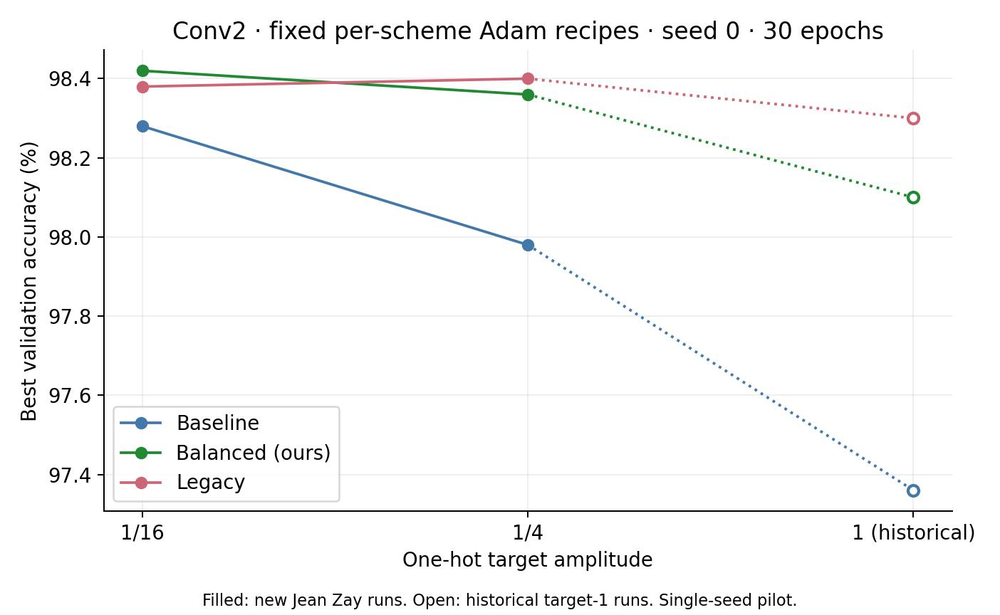

# Why does legacy perform better?

## Research question

Why does in the clean experiments/when we have finite w_max/w_min legacy perform better than the other two schemes?

Study clean learning with finite conductance bounds, comparing baseline
(voltage/current amplification 1/1), ours (4/1), and legacy (4/0.25).
The imported measurements use perfect diodes and bounds [0,100]; they do not
vary the bounds or establish the effect of a strictly positive lower bound.

## Working interpretation

Filip's interpretation, recorded September 29: legacy's clean advantage depends
largely on voltage magnitude and the target encoding. The clean Conv2 encoding
intervention is the key supporting evidence: reducing the one-hot target from
1/4 to 1/16 reverses the small ours-versus-legacy ranking. Baseline's best
accuracy also increases by 0.30 percentage points.

This proves dependence of the observed single-seed ranking on encoding under
the tested recipes. It does not yet prove that voltage magnitude explains most
of the advantage: the ours/legacy differences are only 0.04 points, and native
unnormalized MSE and scheme-specific learning rates remain part of the treatment.
The broader causal explanation is the campaign's working hypothesis.

## Evidence

- [Clean Conv2 encoding intervention: best and final accuracy](series/001-clean-voltage-and-encoding/results/exp-001-conv2-target-encoding.md).
- [Voltage magnitude over layers: initialization and clean trained checkpoints](series/001-clean-voltage-and-encoding/results/exp-002-layerwise-voltage.md).

The voltage figure uses clean **EqProp** checkpoints: Conv1 epoch 10, Conv2/3
epoch 30, seed 0, the same 576 validation examples. It measures RMS voltage,
including readout, on logarithmic axes. Baseline has the largest trained hidden
RMS; legacy has larger readout RMS than the other two schemes. These are separate
checkpoints from the **BPTT** encoding intervention.

Open markers at target 1 are historical references, not new matched target-1 runs.

## Current direction

Separate encoding sensitivity from its causal explanation. The next useful
control is a matched clean baseline/legacy output-rescaling comparison, followed
by independent seeds and an explicit conductance-bound intervention. These are
proposals; campaign creation launches no new simulations.

[Ideas](ideas.md) · [Reasoning and controls](explorations/X-001-voltage-and-encoding.md)
· [Campaign ledger](ledger.md). Historical pilot and result paths are preserved
in the imported evidence notes; new planning for this question belongs here.
