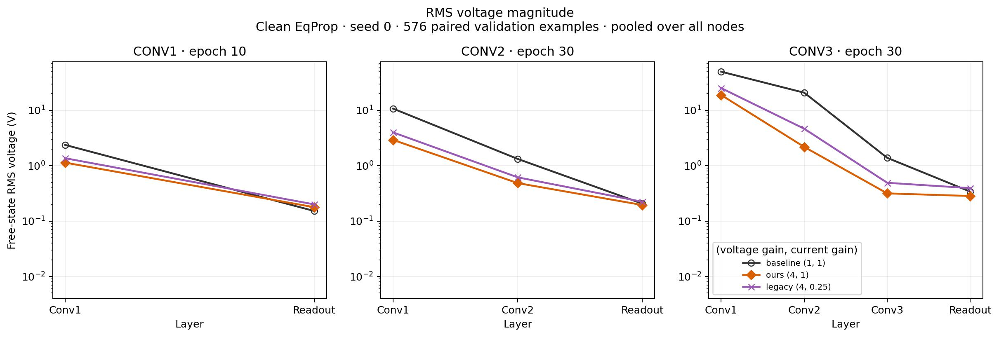

# Voltage magnitude over layers

Imported September 29 from the validated September 28 clean EqProp replay.
The original review reports 18 contexts and 54 layer rows, shared 576-example
validation cohort, exact checkpoint restore and unchanged weights. This import
reuses that validation and performs no new model evaluation.

Free-state RMS in volts, seed 0, final clean EqProp checkpoints:

| Model | Scheme | Conv1 | Conv2 | Conv3 | Readout |
|---|---|---:|---:|---:|---:|
| Conv1, epoch 10 | baseline | 2.3780 | — | — | 0.15210 |
| Conv1, epoch 10 | ours | 1.1378 | — | — | 0.17814 |
| Conv1, epoch 10 | legacy | 1.3673 | — | — | 0.20025 |
| Conv2, epoch 30 | baseline | 10.7464 | 1.32666 | — | 0.20718 |
| Conv2, epoch 30 | ours | 2.9252 | 0.48545 | — | 0.19520 |
| Conv2, epoch 30 | legacy | 3.9951 | 0.61702 | — | 0.22357 |
| Conv3, epoch 30 | baseline | 49.9788 | 20.8434 | 1.38781 | 0.34034 |
| Conv3, epoch 30 | ours | 18.9404 | 2.18640 | 0.31639 | 0.28393 |
| Conv3, epoch 30 | legacy | 25.2334 | 4.66346 | 0.49192 | 0.39376 |

[Initialization versus trained profiles](figures/free_rms_initial_vs_trained.jpg)
· [Full layer measurements](figures/voltage_profiles.csv).

The nearly flat later-layer initialization profiles do not persist through the
trained convolutional layers. Baseline has the largest hidden RMS in every
architecture; legacy has the largest readout RMS. Thus a simple "legacy wins
because all its voltages are larger" explanation is inconsistent with these
trained profiles. Voltage scale relative to the encoding, layer position and
optimization remains the relevant working mechanism.

These independently trained EqProp checkpoints are **not** the BPTT checkpoints
from the encoding test. The plot is operating-point evidence, not proof of the
accuracy mechanism or of a finite-bound effect. It uses native finite iteration
budgets; it does not newly qualify equilibrium convergence. H-002 remains
inconclusive. Original paths and copied-file hashes: [provenance](figures/provenance.json).
