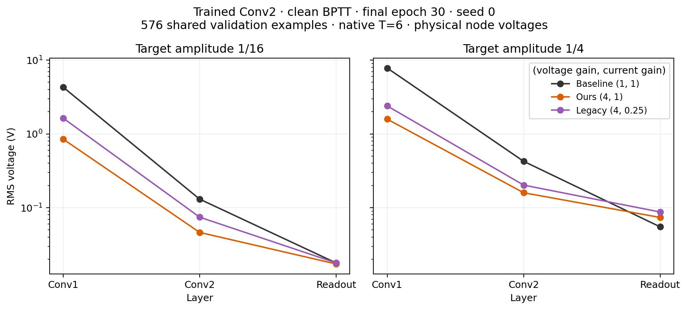

# Trained Conv2 BPTT voltage magnitudes: 1/16 and 1/4

Measured September 29 in the actual encoding-run checkpoints from exp-001:
clean BPTT, seed 0, final epoch 30, native float32 and T=6. These are separate
from the clean EqProp checkpoints in exp-002. All six networks were replayed
on the same 576 validation examples with unchanged weights.

Count-weighted physical-node RMS voltage in volts; logarithmic vertical axis:

| Encoding | Scheme | Conv1 | Conv2 | Readout |
|---|---|---:|---:|---:|
| 1/16 | Baseline | 4.298558 | 0.130596 | 0.017830 |
| 1/16 | Ours | 0.849857 | 0.046231 | 0.017278 |
| 1/16 | Legacy | 1.635190 | 0.074384 | 0.017855 |
| 1/4 | Baseline | 7.806969 | 0.425027 | 0.055000 |
| 1/4 | Ours | 1.586160 | 0.159423 | 0.073745 |
| 1/4 | Legacy | 2.394683 | 0.202369 | 0.087426 |

At both encodings, hidden-layer magnitudes rank **baseline > legacy > ours**.
Legacy has the largest readout RMS, but all three readouts nearly coincide at
1/16 (0.01728–0.01786 V). Reducing the target from 1/4 to 1/16 lowers every
measured layer in all three trained schemes; the change is not restricted
to the readout, and it is not uniform multiplication by 1/4.

Together with [the accuracy measurements](exp-001-conv2-target-encoding.md),
these measurements show that encoding changes both the learned voltage profile
and the observed ranking. They do not isolate voltage as the cause of the
accuracy differences: native unnormalized MSE, scheme-specific learning rates,
and independently learned weights remain involved. In particular, legacy's
accuracy advantage cannot be explained simply by having the largest voltages
everywhere. H-002 remains inconclusive; no new training is assigned.

The readout RMS pools 20 physical nodes, whereas training targets apply to ten
pairwise differences. Its magnitude is not directly the target amplitude or
the RMS of the ten class scores. Shared offsets within pairs also contribute.

[Signed-mean companion](figures/conv2_encoding_signed_mean_trained.jpg) ·
[All layer statistics and checkpoint paths](figures/conv2_encoding_voltage_profiles.csv) ·
[Validation summary](figures/conv2_encoding_voltage_validation.json) ·
[Source paths, checkpoint identities and artifact hashes](figures/conv2_encoding_voltage_provenance.json).

Validation: all six smoke and six production cases plus parent bundles passed
`experiments.reporting.validate_run`; the analyzer reconciled 18 layer profiles,
576 examples per case, exact restoration, unchanged parameters and input bytes,
finite states, zero biases, native precision and RMS/mean/std consistency.
Cohort SHA-256: `95af3eebd9416ec643b7d698d061b7dac3fe0d52311dd888293609bada629acd`.
No failed attempts, exclusions, optimizer steps or official-test reads.
Canonical local evidence: `results/conv2-target-scale-voltage-20260929-v1/`.
