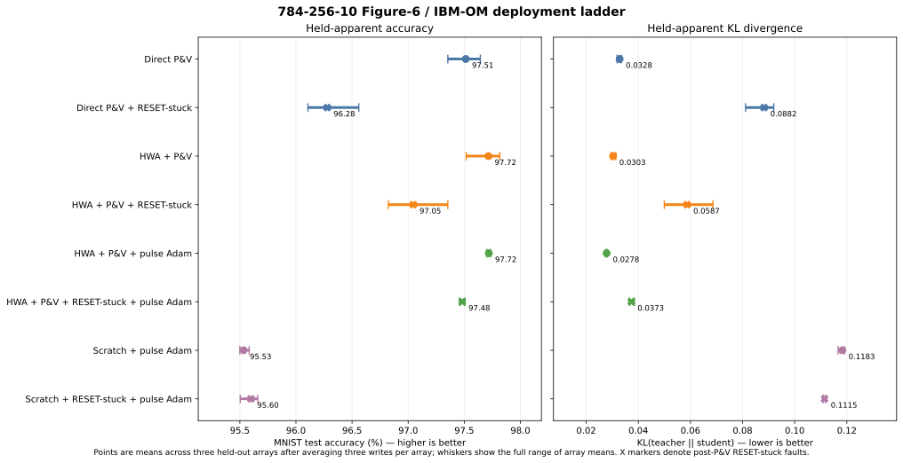

# 784-256-10 Figure-6 / IBM-OM deployment ladder

- Status: complete exploratory result
- Evidence tier: `exploratory_noncanonical`
- Completed: 2026-09-04 23:18 UTC
- Primary network state: current held apparent device state
- Persistent state: write authority and secondary diagnostic only

## Question

This experiment asks how a `784-256-10` perfect-diode DRN behaves under four
matched deployment and adaptation choices:

1. direct teacher mapping followed only by program-and-verify (P&V);
2. the same completed deployment followed by post-P&V RESET-stuck corruption;
3. off-chip hardware-aware training (HWA) followed by those same two
   deployment conditions; and
4. pulse-mediated Adam adaptation from the HWA deployments, compared with
   pulse-mediated Adam training from an independent Kaiming initialization.

The physical DRN has dimensions `[1568,512,20]` and uses 813,056 physical
cells in a four-cell dual-rail encoding. The final evaluation covers three
independently sampled OM arrays and three stochastic writes per array. Each
table entry first averages the three writes within an array and then reports
the mean and full range of the three array means. A range is descriptive
replication coverage, not a confidence interval.

## Primary held-apparent results

`KL` below is `KL(teacher || student)` after applying the one positive logit
gain (`3.1622776601683795`) selected on the development endpoints and frozen
for every final arm. Lower KL is better.

| Arm | Apparent accuracy, mean [array range] | Apparent KL, mean [array range] |
| --- | ---: | ---: |
| Direct P&V | 97.51% [97.35%, 97.64%] | 0.03282 [0.03186, 0.03350] |
| Direct P&V + RESET-stuck | 96.28% [96.11%, 96.56%] | 0.08824 [0.08114, 0.09197] |
| HWA + P&V | 97.72% [97.52%, 97.82%] | 0.03031 [0.02974, 0.03137] |
| HWA + P&V + RESET-stuck | 97.05% [96.82%, 97.35%] | 0.05870 [0.04996, 0.06862] |
| HWA + P&V + pulse-mediated Adam | 97.72% [97.70%, 97.73%] | 0.02782 [0.02744, 0.02809] |
| HWA + P&V + RESET-stuck + pulse-mediated Adam | 97.48% [97.46%, 97.51%] | 0.03730 [0.03648, 0.03849] |
| Scratch + pulse-mediated Adam | 95.53% [95.50%, 95.58%] | 0.11826 [0.11663, 0.11909] |
| Scratch + RESET-stuck + pulse-mediated Adam | 95.60% [95.50%, 95.66%] | 0.11145 [0.11088, 0.11174] |

The associated hidden-persistent-state evaluations are diagnostics only. They
use the same examples, solver, and fixed gain as the apparent evaluations.

| Arm | Persistent accuracy diagnostic | Persistent KL diagnostic |
| --- | ---: | ---: |
| Direct P&V | 97.31% [97.04%, 97.53%] | 0.02111 [0.01719, 0.02490] |
| Direct P&V + RESET-stuck | 95.93% [95.66%, 96.10%] | 0.06474 [0.05995, 0.07113] |
| HWA + P&V | 97.62% [97.37%, 97.76%] | 0.02694 [0.02485, 0.02847] |
| HWA + P&V + RESET-stuck | 96.88% [96.70%, 97.14%] | 0.04683 [0.04302, 0.05436] |
| HWA + P&V + pulse-mediated Adam | 97.40% [97.33%, 97.45%] | 0.02798 [0.02615, 0.03062] |
| HWA + P&V + RESET-stuck + pulse-mediated Adam | 97.17% [97.11%, 97.27%] | 0.03600 [0.03381, 0.03819] |
| Scratch + pulse-mediated Adam | 95.44% [95.40%, 95.48%] | 0.11921 [0.11804, 0.12065] |
| Scratch + RESET-stuck + pulse-mediated Adam | 95.48% [95.41%, 95.57%] | 0.10945 [0.10848, 0.11011] |

## Matched effects

All deltas in this section use the primary held-apparent state and are paired
by array and write. An accuracy delta is in percentage points; a negative KL
delta is an improvement.

| Comparison | Accuracy delta | KL delta |
| --- | ---: | ---: |
| Direct: add post-P&V corruption | -1.234 pp | +0.05542 |
| Clean deployment: HWA minus direct | +0.202 pp | -0.00251 |
| Corrupted deployment: HWA minus direct | +0.767 pp | -0.02953 |
| Clean HWA deployment: add pulse Adam | +0.003 pp | -0.00249 |
| Corrupted HWA deployment: add pulse Adam | +0.437 pp | -0.02140 |
| Clean pulse Adam: HWA initialization minus scratch | +2.186 pp | -0.09044 |
| Corrupted pulse Adam: HWA initialization minus scratch | +1.883 pp | -0.07415 |

KL exposes effects that top-1 accuracy partly hides. Clean HWA recovery leaves
accuracy essentially unchanged but lowers KL by 8.2%. On corrupted HWA
deployments, recovery improves accuracy by 0.437 points and lowers KL by 36.5%.
Comparing the recovered clean and corrupted HWA arms shows that adaptation
closes about two thirds of the corruption penalty in both accuracy and KL,
leaving a residual gap of 0.237 points and 0.00948 KL.

HWA also matters before recovery. It improves corrupted P&V accuracy by 0.767
points over direct deployment and reduces KL by 0.02953. After ten available
Adam epochs, the HWA-initialized models remain 1.88--2.19 points more accurate
than the independently initialized scratch models and have much lower KL.
These HWA-versus-scratch comparisons are best-tuned-per-initialization
comparisons: HWA selected learning rate `1e-4`, while scratch selected `3e-4`.
They are not same-learning-rate causal contrasts.

The small apparent advantage of corrupted over clean scratch training
(+0.066 points and -0.00681 KL) must not be interpreted as corruption helping.
It is a result of two separately evolving pulse plants under a short,
best-checkpoint-selected exploratory budget and needs independent replication
before mechanistic interpretation.

## What “pulse-mediated Adam” means

The Adam arms did **not** run autonomous Adam on a physical chip. They are
hardware-in-loop simulations with a digital optimizer and an open-loop device
writer:

- the initial deployment uses closed-loop P&V with apparent verification and
  at most 128 target-programming pulses per cell;
- every gradient-producing DRN forward and every validation/checkpoint choice
  uses the current held apparent state;
- BPTT gradients, Adam first/second moments, and pulse-selection probabilities
  are computed digitally/off-chip;
- an Adam update can request at most one stochastic SET or RESET pulse per
  cell per minibatch, with a cumulative 640-pulse cell cap;
- recovery performs zero verify reads and does not issue repeated pulses until
  a target tolerance is reached; and
- a touched cell's persistent state changes through the OM pulse equation,
  its apparent state is refreshed once using the declared write-noise model,
  and that held apparent value is used by the next forward. Untouched cells
  keep their prior apparent value, and noise is not redrawn per example.

Thus the training loop has hardware-state feedback through subsequent
apparent-state forwards, but the **write operation itself is open-loop**. The
accurate label is `open_loop_OM_pulse_Adam` or “pulse-mediated Adam recovery,”
not unqualified “on-chip Adam.”

The selected HWA recovery checkpoint was epoch 1 for all 18 clean/corrupted
replicas and used about 0.93 million clean or 0.95 million corrupted update
pulses on average. Scratch checkpoints were selected between epochs 6 and 10
and used about 25.2 million clean or 27.0 million corrupted pulses on average.
This is consistent with HWA providing a near-deployable initialization rather
than asking the pulse optimizer to learn the network from scratch.

## Why this does not contradict the earlier 40--50% deployment

The earlier
[`Figure-6/OM corruption pilot`](figure6_om_pulse_corruption_experiment.md)
and this campaign use the same OM
pulse law but do not apply the same physical fault. The earlier
`published-corrupt` arm samples native OM singleton-stuck cells **before**
P&V. Those cells remain near the middle of the normalized window
(`p=0.495--0.505`) and cannot respond to SET or RESET pulses. This campaign
instead runs apparent-feedback P&V on a fully repaired population first and
then forces the paired mask to `p=0`.

| Run and condition | Network | Fault timing/state | Exact constrained accuracy before stochastic P&V | Apparent P&V/fault accuracy |
| --- | --- | --- | ---: | ---: |
| Earlier repaired control, independent endpoints | `784-50-10` | No stuck cells | 95.94% | 95.64% |
| Earlier published-corrupt arm, independent endpoints | `784-50-10` | Mid-window singleton stuck before P&V | 60.16% | 48.28% |
| Current direct clean arm | `784-256-10` | Repaired plant | -- | 97.51% |
| Current direct post-P&V fault arm | `784-256-10` | RESET-stuck after apparent-feedback P&V | Not evaluated as a pre-P&V condition | 96.28% |

The earlier collapse is already mostly present before stochastic programming:
putting 13.5% of cells near `p=0.5` injects a large unintended conductance into
many rail branches that should be at RESET. The controller then wastes pulses
on cells that cannot move. In the earlier independent/direct arm it completed
86.73% of cells, and only 0.074% of corrupt cells ended persistently inside the
target tolerance.

The new intervention is gentler. In the inspected `array_1/write_1` direct
replica, 54,676 of 109,584 selected fault cells already had an exact `p=0`
target, so the fault did not change them. The other 54,908 cells lost their
active contribution instead of acquiring a spurious mid-window contribution.
The larger hidden layer also provides substantially more redundancy. Before
the fault, P&V genuinely issued 2,462,525 pulses over 368,171 cells, exhausted
the 128-pulse budget on 81 cells, and reported 99.990% apparent controller
completion; high accuracy is not the result of bypassing P&V. Only 66.09% of
healthy persistent endpoints were inside the same target tolerance in this
replica, so the completion number is apparent acceptance rather than a claim
of exact persistent target realization.

State choice is not the explanation either. The new direct clean mean is
97.51% apparent and 97.31% persistent; after the RESET-stuck intervention it
is 96.28% apparent and 95.93% persistent. Both state views remain high.

More broadly, this campaign replaces native OM bound locations with the
analyst-defined Figure-6 RESET/SET endpoints. It therefore also cannot overturn
older low-accuracy results caused by native OM bounds, reference/baseline
placement, codebooks, or full-conductance loading. A direct reconciliation
requires a new matched factorial that crosses fault state (native singleton
versus post-P&V RESET) and network width while freezing everything else.

## Experimental construction

- The bias-free ReLU teacher has dimensions `[784,256,10]`; its selected
  validation checkpoint reached 97.76% accuracy.
- The student is a perfect-diode DRN using the asynchronous four-iteration
  solver and four-cell dual-rail encoding.
- HWA updates a clean digital master against 64 fixed endpoint views. It models
  endpoint variation but not P&V residuals or the post-P&V fault during HWA.
- Each clean deployment is programmed first on a counterfactually repaired OM
  population. The corrupted arm is then an exact clone followed by an
  immutable RESET-stuck intervention using the paired published-OM mask.
- The three held-out arrays contain 109,584, 109,011, and 109,821 faulted cells,
  respectively: 13.48%, 13.41%, and 13.51% of the 813,056 cells.
- Every final arm contains nine raw records: three writes on each of three
  arrays. Test data are opened only for the selected checkpoints.

## Interpretation and limits

The result supports three exploratory conclusions. First, clean direct P&V is
already strong for this hybrid Figure-6 endpoint/IBM-OM pulse model. Second,
HWA provides its clearest benefit under the declared post-P&V fault and lowers
KL more strongly than its modest top-1 gain suggests. Third, open-loop
pulse-mediated Adam can recover a substantial fraction of that fault penalty,
but it adds almost no clean top-1 accuracy and does not make scratch training
competitive within ten epochs.

This does not establish measured-array behavior or autonomous on-chip
learning. Figure-6 endpoint marginals are analyst-defined; the IBM-OM pulse
equations are simulated AIHWKit 1.1.0 dynamics; the RESET-stuck event is a
synthetic intervention; gradients and Adam moments are digital; and there is
no physical-power claim. The campaign is exploratory rather than
workflow-managed canonical evidence. Promotion would require a predeclared
formal study and a new run under the full workflow, not retrospective
relabeling of these artifacts.

## Provenance and artifacts

- Frozen source revision: `2b283365063931e9fdd41fbd30d2672e0e600f04`
- Config: [`full.json`](../examples/mnist_relu_drn/figure6_om_784_256_10_postpv_fault/full.json)
- Config SHA-256: `c07b3a7f0d11f2fb66f0f8373e9e48f26f7faa12a908a1f4198a984bf7f7d66e`
- Terminal summary SHA-256: `6ecbbb845c14652bf9692799bbc29fe3b1634b14509c0a3ab0731e2f34d3d89e`
- Raw-record SHA-256: `ec987d388eaba120fd1f0faa6ff1bd9f9164e51dee0602ebc2017a342a12c605`
- Local terminal summary:
  `simulation_results/exploratory_noncanonical_figure6_om_784_256_10_postpv_fault/stages/summarize/main/20260904T231843.990719Z-9c8ca7b4-f482ce6c/scientific_summary.json`
- Local raw records:
  `simulation_results/exploratory_noncanonical_figure6_om_784_256_10_postpv_fault/stages/summarize/main/20260904T231843.990719Z-9c8ca7b4-f482ce6c/artifacts/raw_records.json`
