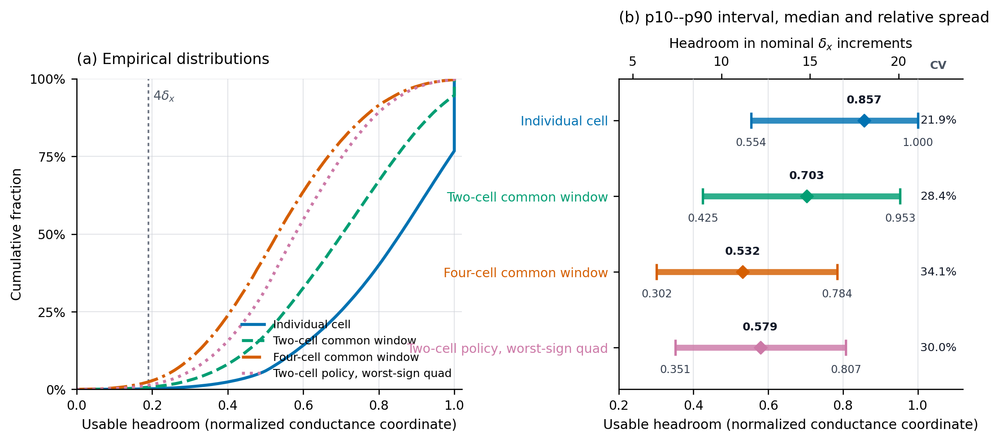

# IBM OM four-device baseline-selection study

- Study ID: `mnist-ibm-om-four-device-baseline-selection-20260828-v1`
- Experiment ID: `mnist_ibm_om_baseline_selection.v1`
- Date frozen: 2026-08-28
- Evidence class: `model_based_aihwkit_preset`
- Device model: AIHWKit 1.1.0 `ReRamArrayOMPresetDevice`
- Status: complete, artifact-verified, scientifically reviewed, and finalized;
  all 12 declared native runs passed the fail-closed study analysis

## Question

For a four-device dual-rail quad, which physically valid baseline rule makes
logical weight zero behave most like zero before any optimizer update?

This study changes the baseline policy only. It does not choose the final
level spacing or level count. The primary target is therefore continuous
within the exact active-pair headroom. A four-delta nearest-level map is
reported from the same selected calibration as a secondary diagnostic.

## Post-run conductance-range correction

The completed run remains valid for its frozen contract, but that contract is
narrower than the branch's intended physical question. It did not retain the
full sampled native OM range. It formed

```text
x_raw = (a+1)/2,
x_public = clip(x_raw, 0, 1),
```

and used `x_public` for commissioning bounds, target construction, and the
full-conductance DRN map. Consequently, `x=1` was an analyst-imposed public
circuit ceiling, not a sampled SET limit or a physical discontinuity of the
OM device.

The censoring is material. Across the 476,400 held-out cells used below,
49.90% of the raw sampled upper coordinates exceed `x=1` and were stored as
exactly `1`; 23.25% of the resulting cell headrooms are exactly `1`. The
reported individual-cell `p90=1.000` is therefore a ceiling artifact. As a
diagnostic only, recomputing individual RESET-to-upper-bound margins on the
same repaired identities without the public `[0,1]` clipping gives
`p10=0.584`, median `0.978`, and `p90=1.402`. That diagnostic is not itself a
replacement study result. The subsequent no-clipping baseline/spacing screen
reran group feasibility, baseline placement, full-conductance loading,
calibration, ideal accuracy, and persistent P&V under the corrected embedding.

The intended forward contract allows any **nonnegative** physical conductance.
It must retain raw sampled bounds and use one predeclared global affine map,
for example

```text
G = G0 + s x_raw,    s > 0,
```

with `G0` chosen so every used branch conductance is nonnegative. The same
`G0` and `s` must be shared across cells and matched assignments; per-cell
renormalization is not allowed. The affine scale must also be decoupled from
the largest conductance accepted by the DRN, and P&V endpoints must not be
clipped merely because `x_raw>1`. Because the OM preset has no absolute
conductance calibration, `G0` and `s` remain declared normalized circuit
embedding parameters rather than microSiemens claims.

This correction preserves the algebraic result that logical zero needs a
baseline shared by four cells or by each two-cell destination column. It makes
the quantitative headroom distributions and policy accuracies specific to the
historical clipped contract. Their use as unrestricted-conductance deployment
evidence is superseded by the completed no-clipping successor below.

## Decision and current branch focus

The completed comparison supports one baseline-grouping rule: do not assign
four independent zero-state baselines to the four rails of a logical weight.
Choose a physically shared baseline that makes the full-conductance logical
zero exact. The two viable grouping choices are:

1. one baseline shared by all four cells in the rail quad; or
2. one baseline shared by each two-cell destination column, giving two
   baseline values per quad.

Under the completed clipped mapping, both groupings recover useful ideal
bounded continuous initialization. The two-cell destination-column policy is
the practical structural parent for the immediate follow-up because it reached
the higher continuous and frozen four-delta means while retaining exact zero
contrast. This is an operational grouping selection, not a claim that the
predeclared comparison found a unique continuous winner among all four
policies or that its numerical range placement transfers unchanged.

This study selects the grouping of the baseline, not where the baseline
should lie inside the devices' usable ranges. The follow-up position/spacing
screen under the corrected unrestricted-positive-conductance embedding is now
complete. Every physical cell has a different
commissioned RESET state and sampled SET bound, so a shared group has only the
intersection of its members' RESET-to-SET windows available. For bounded
commissioned RESET values `b_i` and sampled upper bounds `u_i` in one group,
define
`L=max_i(b_i)` and `U=min_i(u_i)`. Choosing `B` inside the feasible interval
`[L,U]` trades upward SET headroom `U-B` against downward RESET headroom
`B-L`.

Baseline position must be selected jointly with adjacent level spacing `h`:

```text
N_down = floor((B-L)/h),
N_up   = floor((U-B)/h).
```

These are mechanical whole-level capacities inside the shared window, not a
claim of stochastic pulse reachability. Moving `B` or changing `h` changes
the number of such levels, while a smaller `h` may make adjacent codes harder
to distinguish under stochastic program-and-verify. The first follow-up
varied baseline position and spacing together and evaluated both ideal
quantization and persistent P&V. Its frozen contract and completed exploratory
result are documented in
[`ibm_om_baseline_spacing_pv.md`](ibm_om_baseline_spacing_pv.md). That report
now preserves the clipped result and records its completed no-clipping
successor separately.

## Accuracy definitions

The primary metric is
`ibm_om.ideal_bounded_continuous_init.v1`, reported as
`ideal_bounded_continuous_init_accuracy`. It is exact top-1 `correct/10000`
on an untouched held-out OM assignment after bounded deterministic mapping of
the frozen pre-BPTT ReLU checkpoint. It includes the frozen error of the
eight-read RESET commissioning step, but excludes BPTT/QAT, HWA, stochastic
target writes, P&V, inference read noise, retention, and drift. In this
completed study, "bounded" specifically means the intersection of sampled
native support with the imposed public `x in [0,1]` interval.

The secondary metric is
`ibm_om.ideal_bounded_standard4delta_init.v1`, reported as
`ideal_bounded_standard4delta_init_accuracy`. Adjacent target levels are
exactly `4 * (nominal_dw_min/2)` apart in `x=(a+1)/2`; half-step ties round
away from zero and indices are capped by the exact active-pair headroom. It
uses the scale pair and logit gain selected by the continuous development
map and is never independently refit.

The other two deployment-ladder metrics remain reserved for later studies:
`same_hardware_bptt_accuracy` and
`cross_hardware_deployment_accuracy`. Neither is measured here.

## Full-conductance invariant

Every rail is materialized and evaluated as

```text
G_i = B_i + d_i.
```

No baseline is removed before solving the circuit. For canonical quad order
`(++,+-,-+,--)`, the represented contrast and total loading are derived only
from the full conductances:

```text
C(G) = (G++ - G+- - G-+ + G--)/2,
L(G) = G++ + G+- + G-+ + G--.
```

The physical DRN tensor containing every `G_i` enters both numerator and
denominator KCL terms. Algebraic cancellation at zero is a checked property
of a policy, never an implementation shortcut.

## Frozen hardware and source

- Frozen logical source: `data/mnist_relu_teacher_fixed_init_20260816.pt`,
  SHA-256
  `9a961a77628e365b54fdf59304ec7fddf46f1f4834c4c03cecea9c204f837f52`.
- Development assignment: `86001`.
- Untouched held-out assignments: `87001`, `87002`, and `87003`.
- Corrupt published cells are replaced by the existing
  `counterfactual_repaired` OM sampler before the baseline intervention.
- Each sampled cell is commissioned by eight sequential cycles of one RESET
  pulse followed by one apparent raw-`a` read, without reinitialization. The
  arithmetic mean is converted to `x`; the completed runtime clips both the
  sampled bounds and the mean to the public `[0,1]` interval before applying
  the cell-bound projection. This is the historical contract being corrected,
  not an intrinsic device limit.

One deterministic joint repair is constructed per assignment before any
calibration or accuracy evaluation. A destination quad is retained only if it
is feasible under all four policies. Otherwise the complete four-identity
quad and its matching commissioning observations are replaced by the first
feasible candidate in its private, disjoint 128-candidate donor block. The
same repaired assignment and hardware-instance fingerprint must appear in
all four policy runs. Donor exhaustion invalidates the assignment; no weight
may be dropped and no policy may consume its own donor stream.

## Baseline policies

Let `b_i` be a cell's bounded commissioned RESET mean, and let `l_i,u_i` be
its mapped bounds.

1. `independent_cell_reset_mean`: each rail uses `B_i=b_i`. This is the
   matched heterogeneous-origin control and is not required to have zero
   baseline contrast.
2. `shared_quad_reset_max`: all four rails use
   `B_Q=max_i b_i`, provided that value lies within all four cells' bounds.
3. `shared_destination_columns_reset_max`: the two rails contributing to
   each output numerator share a baseline:
   `B++=B-+=max(b++,b-+)` and
   `B+-=B--=max(b+-,b--)`. These are destination-column groups, not the
   historical source-row pairing. Their zero contrast is exact even if the
   two column baselines differ.
4. `reference_enforced_destination_columns`: two cells are fixed intrinsic
   references and two are tunable active cells. For a positive logical
   weight, `-+` and `+-` are references and the baselines of `++` and `--`
   equal their respective partner references. Negative weights swap active
   and reference roles. A sampled `r` must lie unmodified in both its own
   cell's and its partner's bounds and in the public coordinate; otherwise
   the joint donor rule applies. Zero ties use the positive role convention.

The first three policies use the same commissioned observations. The
reference-enforced policy generates and records the same commissioning
receipts for matched provenance but does not use RESET means to construct its
targets.

## Mapping and calibration

For logical `U=W/max|W|`, only the two sign-selected rails are raised. The
continuous magnitude is

```text
d = f_layer * H_active_pair * |U|,
```

where `H_active_pair` is the smaller positive headroom of the two rails that
encode that sign. Inactive-cell upper bounds do not reduce this envelope.
The development assignment searches all 16 layer-scale pairs from
`{0.125,0.25,0.5,1.0}^2`. Each policy selects continuous calibration accuracy
first, calibrated KL second, and the lexicographically smallest pair last;
its positive logit gain is fitted on the calibration subset. The selected
pair and gain are frozen for the held-out assignment and for the four-delta
diagnostic.

## Weight-error report

The study reports the difference between mapped DRN contrasts and the source
ReLU weights, not only classification accuracy. On development data only,
each layer fits the zero-intercept analysis scale

```text
s = <U, C_continuous-C_baseline> / <U,U>,   s > 0.
```

This scale is frozen for held-out reporting and never changes the circuit or
accuracy. With `A=max|W|`, the reconstructed teacher-unit weight is
`W_hat=A*C/s`. Reports separate baseline, continuous-headroom, four-delta
quantization, and total errors and include signed mean, MAE, RMSE, p50, p95,
maximum absolute error, relative L2, cosine similarity, sign reversals, and
erased weights per layer. Raw model conductance units and normalized
coordinates remain clearly labelled; no absolute-Siemens claim is made.

At synthetic `d=0`, the study additionally reports `C(B)/h`, full quad
loading, and the solved rail-voltage residual. Exact zero contrast is a
validity invariant for the shared-quad, destination-column, and
reference-enforced policies. It is a diagnostic, not a second winner metric.

## Decision rule

A policy is the baseline winner only if it has a strictly larger continuous
correct count than every other policy on each of the three paired held-out
assignments and its arithmetic-mean continuous accuracy exceeds the
runner-up mean by at least `0.0100`. Otherwise the result is
`inconclusive/no winner`. Separately, a winner passes the initialization gate
only at a held-out mean of at least 90%. Four-delta accuracy and weight-error
statistics explain the result but cannot overturn this predeclared rule.

## Artifact-verified results

All 12 production RunStore bundles passed registered-hash, schema, source,
matched-hardware, full-conductance, bound, exact-zero, prediction-count, and
frozen-calibration checks for the declared `[0,1]`-clipped mapping. The
held-out results over assignments `87001`, `87002`, and `87003` were:

| Policy | Continuous correct / 10000 | Continuous mean (range) | Four-delta mean (range) |
| --- | ---: | ---: | ---: |
| `independent_cell_reset_mean` | 5694, 3794, 5986 | 51.58% (37.94--59.86%) | 48.73% (39.80--54.79%) |
| `shared_quad_reset_max` | 9446, 9276, 9425 | 93.82% (92.76--94.46%) | 86.29% (84.23--87.91%) |
| `shared_destination_columns_reset_max` | 9467, 9470, 9555 | 94.97% (94.67--95.55%) | 88.56% (85.80--90.98%) |
| `reference_enforced_destination_columns` | 9491, 9529, 9479 | 95.00% (94.79--95.29%) | 12.38% (8.16--14.84%) |

The independent per-cell control failed badly, whereas sharing one baseline
across four cells or within each two-cell destination column raised the
continuous mean by `42.24` and `43.39` percentage points, respectively. The
destination-column policy exceeded the shared-quad policy on every held-out
assignment, by `1.15` points in the continuous mean and `2.27` points in the
four-delta mean. The result therefore supports exact shared-zero grouping as
the baseline mechanism and carries the destination-column form forward as the
practical structural parent. Its numerical placement remains specific to the
clipped mapping.

The predeclared unique-winner decision remains `inconclusive/no winner`.
Reference enforcement led destination-column RESET sharing by only `0.0233`
percentage point in mean continuous accuracy, did not win on every held-out
assignment, and did not meet the required `1.00`-point margin. Its four-delta
collapse is a level-capacity and spacing diagnostic, not evidence that an
intrinsic reference is inherently harmful. Accordingly, the completed study
narrows the deployable baseline family without claiming a uniquely superior
continuous policy.

### `[0,1]`-censored headroom diagnostic

The baseline-selection result establishes how zero-state baselines should be
grouped, but not where a grouped baseline should lie. The following
descriptive characterization uses the jointly repaired, **public-range-
clipped** physical mappings from the three untouched held-out assignments
(`87001`--`87003`) of the practical
`shared_destination_columns_reset_max` parent. Here `u_i` and `b_i` are the
stored clipped values, not the raw native upper bound and RESET estimate. For
cell `i`, the commissioned RESET-to-SET headroom is `H_i=u_i-b_i`. For a group
`g`, the common window is

```text
H_g = min_i(u_i) - max_i(b_i).
```

The two-cell policy's worst-sign quad headroom is the smaller of its two
destination-column windows. It is the sign-agnostic logical bottleneck, whereas
the two-cell common-window distribution treats the two destination columns as
separate physical groups.



*Figure: Empirical headroom distributions after intersecting native OM support
with the imposed public `x in [0,1]` interval. The sharp upper endpoint and the
individual-cell `p90=1.000` are censored by that rule. Panel (a) shows empirical
CDFs; the vertical line marks the nominal four-delta spacing. Panel (b) shows
p10--p90, the median, and the coefficient of variation. The upper axis
expresses the same clipped-coordinate margin in nominal
`delta_x=0.04745` increments. Counts are 476,400 cells, 238,200 two-cell
groups, and 119,100 quads. These coordinate increments are not constant pulse
displacements, unrestricted native headroom, or evidence of persistent P&V
reachability. Generated by
[`plot_ibm_om_headroom_distribution.py`](../experiments/mnist_relu_drn/plot_ibm_om_headroom_distribution.py).*

| Object under clipped public range | p10 | Median | p90 | CV | Median in `delta_x` |
| --- | ---: | ---: | ---: | ---: | ---: |
| Individual cell, commissioned RESET to SET bound | 0.554 | 0.857 | 1.000 | 21.9% | 18.1 |
| Two-cell common destination window | 0.425 | 0.703 | 0.953 | 28.4% | 14.8 |
| Four-cell common quad window | 0.302 | 0.532 | 0.784 | 34.1% | 11.2 |
| Two-cell policy, worst-sign quad headroom | 0.351 | 0.579 | 0.807 | 30.0% | 12.2 |

Within that clipped embedding, the hierarchy has the following interpretation:

1. **Individual cells are the optimistic ceiling.** The median cell retains
   `0.857`, but those windows cannot be used from independent baselines because
   independent origins produced the zero-contrast failure.

2. **Two-cell sharing pays a moderate exact-zero cost.** Its median common
   window is `0.703`, 17.9% below the individual-cell median. The p10 still
   corresponds to about `9.0 delta_x`, so most destination groups retain a
   substantial coordinate range.

3. **Four-cell sharing adds an extrema penalty.** Its median is `0.532`, 37.9%
   below the individual-cell median, because the largest RESET bound and the
   smallest SET bound among four cells constrain the entire quad. The resulting
   group-window CV rises to 34.1%; this describes wider relative variation in
   the usable intersections, not a change in the underlying cell population.

4. **A two-cell logical weight is limited by its weaker sign.** Taking the
   smaller of the two destination windows lowers the median from `0.703` per
   destination group to `0.579` per logical quad, a further descriptive 17.7%
   reduction. This is the relevant conservative margin when one spacing must
   support either weight sign.

The spread is mainly within an assignment rather than between assignment
means. Mean two-cell common windows are `0.6909`, `0.6912`, and `0.6924` for
the three held-out assignments, a range below 0.23% of their overall mean. By
contrast, the within-assignment group distributions are broad. At the current
RESET-max placement and a nominal spacing of `4 delta_x`, 0.66% of two-cell
groups and 2.39% of four-cell groups cannot fit even one upward interval.

The no-clipping placement-and-spacing successor recomputed these quantities
from raw native support under one global nonnegative affine conductance map;
it did not reuse the table above as though `1` were a device ceiling. Of the
nine tested designs, only `B=L,h=delta_x` passed the 90% ideal gate, at
93.6967% mean held-out accuracy. Its persistent P&V mean was only 54.7013%,
with 49.9727% requested-code correctness, so it did not pass the later
persistent-code gate. The same nominal design ranked first in the clipped
screen, but the clipped screen's 78.1553% unrestricted-deployment conclusion
is superseded. Full results and affine constants are in
[`ibm_om_baseline_spacing_pv.md`](ibm_om_baseline_spacing_pv.md).

## Prior evidence

| Prior pre-training control | Ideal result | Why it is not this matched test |
| --- | ---: | --- |
| Homogeneous four-device no-`r`; scalar fixed `r` | 96.91%; 97.36--97.38% | No sampled identities, per-cell bounds, commissioning, or feasibility problem. |
| Raw-p90 requested shared quad | 91.11% | Seven symmetric levels, global `D90`, and about 10% deliberately unsupported quads. |
| Historical shared RESET-relative | 94.90% | Effective `(a-r+1)/2` coordinate; separate physical `r` and its loading were absent. |
| Native deterministic codebook, independent origins | no-`r` 35.98% (41.02% continuous); fixed-`r` 57.85% (64.35% continuous) | No grouped zero and a different state-dependent codebook. |
| Exact-lower four-delta | no-`r` 31.48% (32.60% continuous); fixed-`r` 23.03% (71.11% continuous) | Heterogeneous per-cell origins/references remain in zero contrast. |
| Per-cell RESET-mean four-delta | no-`r` 25.76% (27.23% continuous); fixed-`r` 23.03% (71.11% continuous) | Direct matched evidence that independent origins fail; no grouping. |

Before this study, one requested baseline per four-cell quad had been tested
only under unmatched historical codebooks, and the exact destination-column
grouping had not been tested in the OM model. This completed study supplies
that matched comparison against independent origins, a quad-shared origin,
and sign-selected partner-reference enforcement.

## Workflow and completion

The four arms and three held-out `ebl validate` configs per arm completed on
CUDA. The fail-closed analyzer verified every RunStore bundle, source and
config hash, population and commissioning receipt, joint hardware
fingerprint, `B+d=G` decomposition, bounds/zero gates, selected calibration,
prediction hash, exact count, and cross-arm match before producing the table
above. Full artifact verification and scientific review are complete.

The canonical artifacts are:

- raw runs:
  `results/mnist-ibm-om-four-device-baseline-selection-20260828-v1/runs/`;
- audited result:
  `results/mnist-ibm-om-four-device-baseline-selection-20260828-v1/analysis/baseline_selection_analysis.md`;
- final review:
  `results/mnist-ibm-om-four-device-baseline-selection-20260828-v1/analysis/review.json`;
  and
- finalized evidence entry: [`experimental_manifest.md`](experimental_manifest.md).
