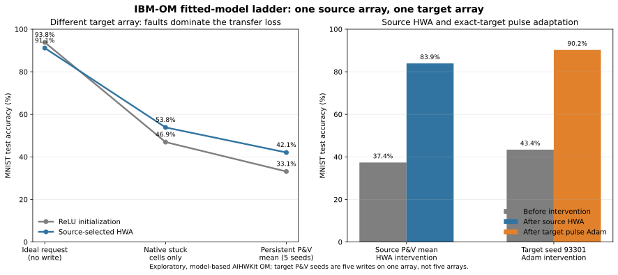

# IBM OM corrupt-array HWA, transfer, and pulse recovery

> **Follow-up:** The three-epoch, single-source HWA limitation diagnosed here
> was tested in a matched six-epoch factorial with two corrupt training
> identities and a tuned output-layer learning rate. See
> [Debugging corrupt-array HWA transfer and pulse recovery](ibm_om_corrupt_multi_source_hwa_tuned_recovery.md).

## Executive result

This exploratory experiment executes one complete, matched deployment ladder:

1. initialize a four-device perfect-diode DRN from the frozen ReLU teacher weights;
2. perform hardware-aware training (HWA) on a source IBM-OM array containing stochastic pulse variation, apparent verify noise, and native stuck devices;
3. freeze the HWA checkpoint before sampling a different target array;
4. remap and program that checkpoint on the target array; and
5. continue one exact target endpoint with open-loop stochastic-pulse Adam.

Source HWA is highly effective on its own array: persistent test accuracy rises from **37.37% to 83.92%**. Its robustness transfers only partially. Across five paired P&V trajectories on the target array, HWA raises the mean from **33.14% to 42.07%** (**+8.93 percentage points, 5/5 wins**). The predeclared target endpoint then recovers from **43.41% to 90.25%** after one pulse-Adam epoch.

The deterministic intermediate rung makes the mechanism unambiguous. On the target, native permanent faults cause the largest loss; stochastic P&V causes a smaller, additional loss:

| Logical state | Ideal requested | Native stuck cells only | Persistent P&V mean |
| --- | ---: | ---: | ---: |
| ReLU initialization | 93.83% | 46.95% | 33.14% |
| Source-selected HWA | 91.14% | 53.84% | 42.07% |

HWA sacrifices 2.69 points of ideal target accuracy, but reduces the permanent-fault penalty by 9.58 points and the additional P&V penalty by 2.04 points. It therefore learns useful fault/noise tolerance, but it does not learn a portable physical solution for a new fault realization. Target-specific pulse adaptation can find a much better task-effective physical state without moving the stuck devices.

## Protocol

The implementation is [ibm_om_corrupt_source_hwa_cross_array_pulse_adam.py](../experiments/mnist_relu_drn/ibm_om_corrupt_source_hwa_cross_array_pulse_adam.py), with the strict [standard-ladder config](../examples/mnist_relu_drn/ibm_om_corrupt_source_hwa_cross_array_pulse_adam/standard_ladder.json) and [runtime](../experiments/mnist_relu_drn/ibm_om_corrupt_source_hwa_cross_array_pulse_adam_runtime.py).

### Initialization and positive conductance

- Teacher: `data/mnist_relu_teacher_fixed_init_20260816.pt`, SHA-256 `9a961a77628e365b54fdf59304ec7fddf46f1f4834c4c03cecea9c204f837f52`.
- Each ReLU weight matrix is divided by its own absolute maximum to form the single FP32 logical master.
- Four physical conductances represent each signed logical weight.
- Healthy OM raw-`a` supports are explicitly Winsorized to `[-1,1]`; native corrupt singletons are never moved.
- The circuit always receives the complete nonnegative conductance
  `G = a + 1 = 2x` in `[0,2]`. No signed conductance and no reference-subtracted `a-r` surrogate enters the DRN.
- The mapping uses the shared-destination `alpha=0` baseline, one-`delta_x` spacing (`delta_x=0.04745` raw `x`), and the fixed logit gain `14.12537544622754`.

### Source HWA

Source assignment 93001 contains 21,515 native corrupt cells out of 158,800. The experiment explicitly enables the AIHWKit OM published corruption probability `p=0.1348`; each corrupt device is a sampled singleton with collapsed bounds and zero upward/downward pulse increments.

A paired counterfactual-repaired copy of the same sampled identity is used only to define mapping baselines and code capacities. The physical HWA views always use the published population with its faults intact; the learner never receives the fault mask.

HWA uses four persistent endpoint tables (seeds 93201–93204) and a disjoint four-table validation bank (93221–93224). Each minibatch combines teacher-KL gradients as

`0.25 * ideal + 0.375 * persistent_view_1 + 0.375 * persistent_view_2`.

The logical master is updated with layerwise SGD learning rates `0.004411914893617021` and `1.1974808510638298e-5` for three epochs. Selection is restricted to trained epochs 1–3 and uses only the source validation split and selection endpoint bank.

### Target deployment and recovery

Target assignment 93002 is sampled only after the selected source checkpoint is saved and hashed. Its assignment seed, published/repaired fingerprints, and construction seeds all differ from the source. It contains 20,968 native corrupt cells.

Both the ReLU-initialized and selected-HWA logical masters are reconstructed on target-owned repaired baselines, then programmed on the literal published target plant with the same five endpoint seeds 93301–93305. The seeds are five stochastic write trajectories on **one target array**, not five arrays.

The deterministic fault-only rung replaces only corrupt target requests with their immutable native singleton. Every healthy requested `G` remains bit-identical and no programming, verify read, or noise is invoked. Direct P&V then starts from sampled lower/RESET state and uses one stochastic pulse at a time, tolerance `0.023725` raw `x`, and a 128-pulse cap. Apparent values control P&V stopping; inference always uses persistent full `G`.

Endpoint 93301 is predeclared as the recovery state. Its complete plant continuation is serialized, reloaded, and checked for exact target, persistent/apparent state, draw-index, construction-seed, and trajectory-seed equality. Recovery uses one epoch of digital Adam with raw-`x` learning rate `3e-5`, a column-serial stochastic-coincidence pulse interface, and no verify calls.

## Results

### Source array

| Source 93001 | ReLU initialization | Selected HWA epoch 3 | Change |
| --- | ---: | ---: | ---: |
| Ideal requested test accuracy | 92.43% | 93.88% | +1.45 pp |
| Persistent test mean | 37.3675% | 83.9225% | +46.555 pp |
| Persistent test range | 31.43–44.44% | 82.60–85.38% | much narrower |

The validation persistent mean increases monotonically over the three trained epochs: 75.41%, 79.86%, and 81.60%. Source HWA therefore learns a strong solution for the source fault/noise realization.

### Different target array

| Endpoint seed | ReLU initialization | Source HWA | Paired HWA gain |
| ---: | ---: | ---: | ---: |
| 93301 | 33.73% | 43.41% | +9.68 pp |
| 93302 | 33.65% | 39.25% | +5.60 pp |
| 93303 | 34.47% | 45.67% | +11.20 pp |
| 93304 | 30.72% | 38.15% | +7.43 pp |
| 93305 | 33.13% | 43.85% | +10.72 pp |
| **Mean** | **33.140%** | **42.066%** | **+8.926 pp** |

The predeclared HWA-transfer gate passes: the mean gain exceeds 2 points and HWA wins on all five paired trajectories (required 4/5). Nevertheless, absolute transfer accuracy remains far below the 83.92% source mean.

### Fault and writer attribution

| Target state | Ideal to fault-only loss | Additional P&V loss | Total ideal-to-P&V loss |
| --- | ---: | ---: | ---: |
| ReLU initialization | -46.88 pp | -13.81 pp | -60.69 pp |
| Source HWA | -37.30 pp | -11.774 pp | -49.074 pp |

All 137,832 healthy target requests are within support. The 20,968 exact-support failures are exactly the immutable corrupt cells. In this published-corruption ladder, array-specific stuck locations—not healthy-cell support mismatch—are the dominant portability problem. Apparent P&V acceptance must still not be confused with reachability: about 14.5k cells exhaust the programming budget, while noisy apparent reads can accept other corrupt cells even though their persistent singleton never moves.

This finding complements rather than contradicts the earlier repaired-population result in [ibm_om_winsorized_training_recovery.md](ibm_om_winsorized_training_recovery.md). In that counterfactual repaired setting, corruption was removed and noisy P&V dominated the remaining loss. Here the published native faults are retained, so they become the larger term.

### Target-specific stochastic-pulse recovery

| Exact target 93002 endpoint 93301 | Accuracy |
| --- | ---: |
| Before Adam | 43.41% |
| After one Adam epoch | 90.25% |
| Gain | +46.84 pp |

The writer issued 55,399 pulse commands: 27,676 upward and 27,723 downward. No probability or pulse-cap clipping occurred; the maximum was five pulses per cell. Of these commands, 7,355 addressed corrupt cells and had exactly zero physical effect. All 20,968 corrupt devices remained bit-identical. There were zero verify reads during training and no negative conductances.

The completed artifact records its composite recovery gate as false only because the original gate demanded symmetric agreement within two points of the 83.9225% source mean. The recovered 90.25% is 6.3275 points **above** that value. Gain and physical-safety subgates pass. The runtime was subsequently corrected for future runs to use the scientifically intended one-sided floor (`post >= source - 0.02`) while retaining symmetric distance as a diagnostic; the completed result artifact remains unchanged.

## Interpretation

The experiment supports three bounded conclusions:

1. HWA can learn a DRN that is dramatically more tolerant to the source array's permanent faults and stochastic programming.
2. Some of this robustness transfers to a different array, but most of the source absolute performance does not because the new stuck-cell realization changes both signed contrast and passive loading.
3. The target still contains enough controllable degrees of freedom for endpoint-specific stochastic-pulse adaptation to recover near-ideal task accuracy, even though no corrupt device moves.

This is consistent with HWA providing a useful robust initialization and target training providing realization-specific compensation. It is **not yet a matched proof of complementarity**, because this run applies Adam only to the HWA target endpoint. The decisive next control is to recover the paired ReLU-initialized target endpoint with identical data order, pulse RNG, optimizer settings, and budget. Comparing convergence, final accuracy, and pulse count would show whether HWA materially improves recovery rather than only its starting accuracy.

The next coverage expansion should then repeat the frozen protocol over multiple independently sampled target array identities. More P&V seeds on assignment 93002 would characterize writer variation, not cross-array portability.

## Evidence boundary and provenance

- Evidence tier: `exploratory_noncanonical`.
- One source array, one target array, five target P&V trajectories, one recovered endpoint.
- The AIHWKit 1.1.0 `ReRamArrayOMPresetDevice` is a normalized, hardware-derived fitted model. This is not raw measured-trace replay and provides no absolute physical conductance calibration.
- Winsorization is an analyst intervention. The result is not a claim about the untouched default preset or fabricated-array power.
- HWA and recovery both use teacher-logit BPTT. Recovery retains digital Adam moments and command RNG; it is hardware-in-loop pulse-mediated training, not autonomous local on-chip learning.
- No inference-read noise, retention, drift, endurance, or peripheral nonideality is modeled.

The terminal run is `20260831T154152.608397Z-168441ac-0aa3ab1b`, produced by implementation commit `164300211ace022c3aacd8f86c60566cad2ea76c`. The worktree was dirty only from preserved documentation edits and is hash-recorded in the manifest. All 30 registered artifacts pass independent SHA-256 and size checks. The registered scientific summary hash is `30cdd1a55858e537594bee6fa7000fe5957ec7c1cd225caa94d0c0ad36b24d40`; the result-local audit summary and report hashes are `654bf6a17b706ae8a2acb6c34f1d20b4cfc33530584022fb40917d50e921aafb` and `bce63c169dcf341408ab89d1dbd7d6782bb9b947aa9f04a15879204623b7326c`.
