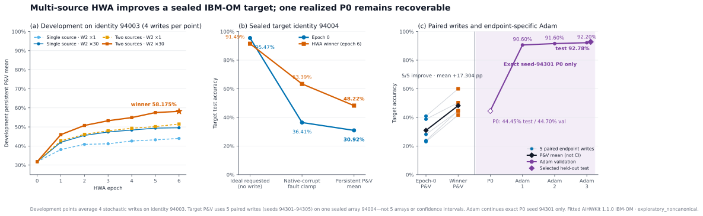

# Debugging corrupt-array HWA transfer and pulse recovery

## Executive result

The poor cross-array result was reproducible. A focused equation and artifact
audit found no evidence of a conductance-sign, pulse-direction, or `dG/dx`
bug. Two protocol limitations were plausible suppressors of HWA:

1. the original source training stopped after three epochs while persistent
   validation accuracy was still increasing; and
2. the output-layer learning rate was so small that only 12 of 500 logical
   output weights changed requested code.

The follow-up addresses both limitations and adds a robustness intervention:
training across two independently sampled modeled assignment identities. A
four-arm, six-epoch factorial selected `multi_w2_x30` at the tested epoch-6
boundary. On a sealed target identity, that checkpoint improves mean
persistent P&V test accuracy from **30.918% to 48.222%** (**+17.304 percentage
points, 5/5 paired wins**). Three epochs of stochastic-pulse Adam then recover
a predeclared target endpoint from **44.45% to 92.78%**.

The improvement is real but bounded. HWA makes the logical state much more
tolerant of a new permanent-fault mask; it does not by itself restore high
zero-shot accuracy after a new stochastic write. Endpoint-specific pulse
training remains the step that closes most of the remaining gap.

## Question and debugging hypothesis

The predecessor ladder trained one ReLU-derived DRN logical state for three
epochs on one corrupt source identity, deployed it to a different corrupt
identity, and recovered one target endpoint with one Adam epoch. It obtained:

- source persistent mean: `37.3675% -> 83.9225%`;
- target persistent P&V mean: `33.140% -> 42.066%`; and
- predeclared target endpoint: `43.41% -> 90.25%` after one Adam epoch.

That result showed strong same-array learning but weak portability. The
post-run audit identified three testable causes.

| Suspected suppressor | Direct evidence | Successor intervention |
| --- | --- | --- |
| Training horizon too short | Source validation persistent mean rose `75.415 -> 79.855 -> 81.605%` through epoch 3 | Train and select over six full epochs |
| Output layer effectively frozen | W2 logical displacement RMS was `0.001747`; only `12/500` W2 weights changed requested code | Compare the old W2 rate with a `30x` rate |
| HWA overfit one fault realization | The target deterministic fault rung lost 37.30 points despite source HWA | Compare one-source HWA with alternating two-source HWA |

No numerical audit found a wrong pulse sign, a missing factor of two, a
negative conductance, or a binding-layout error. The pulse-Adam control was
also far below its pulse cap and had no probability clipping. The successor
therefore changes the experimental protocol rather than patching the physical
equations.

## Matched protocol

The successor is implemented by the strict
[configuration](../experiments/mnist_relu_drn/ibm_om_corrupt_multi_source_hwa_tuned_recovery_config.py),
[runtime](../experiments/mnist_relu_drn/ibm_om_corrupt_multi_source_hwa_tuned_recovery_runtime.py),
and [experiment config](../examples/mnist_relu_drn/ibm_om_corrupt_multi_source_hwa_tuned_recovery/standard_ladder.json).
The figure is regenerated directly from the terminal scientific summary by
[the plotting script](../experiments/mnist_relu_drn/plot_ibm_om_corrupt_multi_source_hwa_tuned_recovery.py).

### Initialization and conductance coordinate

Every HWA arm starts from the same frozen ReLU checkpoint:

`data/mnist_relu_teacher_fixed_init_20260816.pt`

with SHA-256
`9a961a77628e365b54fdf59304ec7fddf46f1f4834c4c03cecea9c204f837f52`.
Each ReLU matrix is divided by its layerwise absolute maximum to obtain the
single FP32 logical master. This is the explicit ReLU-to-DRN initialization;
none of the arms starts from an earlier P&V or Adam state.

The DRN uses four physical devices per signed logical weight. Healthy IBM-OM
raw-`a` supports are Winsorized to `[-1,1]`, while native corrupt singletons
remain unchanged. The circuit always receives the full nonnegative
conductance

`G = a + 1 = 2x`, with `0 <= G <= 2`.

No signed conductance or reference-subtracted surrogate enters the circuit.
The mapping retains the shared-destination `alpha=0` baseline, one-`delta_x`
spacing (`delta_x=0.04745` raw `x`), and fixed logit gain
`14.12537544622754`.

### Native corrupt-device model

The physical populations explicitly enable the AIHWKit IBM-OM published
corruption probability `p=0.1348`. Each selected crosspoint has a sampled
raw-`a` stuck value within its supported intersection with `[-0.01,0.01]`;
its lower and upper bounds collapse to that value and both pulse increments
are zero. These are literal immutable cells, not devices clamped to the global
minimum or maximum.

A paired counterfactual-repaired twin is used only as a mapping oracle. Every
HWA, P&V, and recovery forward pass uses the published population with its
native stuck values. The learner never receives the fault mask.

### Assignment roles and sealing

| Role | Assignment | Endpoint seeds | Use |
| --- | ---: | --- | --- |
| HWA source A | 94001 | 94101-94104 | Training |
| HWA source B | 94002 | 94111-94114 | Training in multi-source arms |
| Development | 94003 | 94201-94204 | Joint arm-and-epoch selection |
| Sealed target | 94004 | 94301-94305 | Final paired deployment |

The source and development identities, construction seeds, fingerprints, and
active fault masks are pairwise distinct. The target identity is not sampled
until the development winner is frozen and hashed. MNIST test data is not used
for HWA or recovery selection.

### Four-arm HWA factorial

All arms use six epochs, identical initialization, minibatch order, update
count, W1 rate, and endpoint-loss mixture:

`0.25 * ideal + 0.375 * persistent_view_1 + 0.375 * persistent_view_2`.

The only interventions are the number of training fault identities and the W2
rate:

| Arm | Published-corrupt training identities | W1 rate | W2 rate |
| --- | --- | ---: | ---: |
| `single_w2_x1` | 94001 | `4.4119149e-3` | `1.1974809e-5` |
| `single_w2_x30` | 94001 | `4.4119149e-3` | `3.5924426e-4` |
| `multi_w2_x1` | 94001, 94002 alternating | `4.4119149e-3` | `1.1974809e-5` |
| `multi_w2_x30` | 94001, 94002 alternating | `4.4119149e-3` | `3.5924426e-4` |

The multi-source arms alternate assignments by global minibatch. Each
assignment has its own visit counter so all four endpoint-table streams are
sampled evenly. Selection considers all 24 trained arm/epoch candidates and
orders them by development persistent mean accuracy, persistent minimum,
mean KL, earlier epoch, and then the predeclared simplicity order.

### Target P&V and recovery

After HWA selection, both epoch 0 and the winner are remapped through the
sealed target's repaired mapping template, then applied to the published
target population. The deterministic fault-only rung replaces only corrupt
requests by their immutable stuck values. It uses no programming or noise.

P&V starts from the sampled lower/RESET state, uses one stochastic pulse per
iteration, a raw-`x` tolerance of `0.023725`, and a cap of 128 pulses. Apparent
values control termination; inference uses persistent full `G` only. The five
endpoint seeds are five writes on one target identity, not five arrays.

Seed 94301 is the predeclared recovery P0. Its plant state, plant RNG,
pulse-selection RNG, and dedicated seed-94402 training-data generator state
are serialized and checked before the first update. Recovery uses three
continuous epochs of teacher-output-KL BPTT plus digital Adam at raw-`x` rate
`3e-5`. Both physical layers update through column-serial stochastic pulse
commands. Epoch selection uses validation accuracy, then KL, then the earlier
epoch; test is opened only after selection freezes.

## Results

### Development factorial

Persistent validation accuracy on held-out assignment 94003 is:

| Arm | Epoch 1 | Epoch 3 | Epoch 6 | Epoch-6 minimum |
| --- | ---: | ---: | ---: | ---: |
| `single_w2_x1` | 38.125% | 41.165% | 43.965% | 42.00% |
| `single_w2_x30` | 41.980% | 47.350% | 49.555% | 47.34% |
| `multi_w2_x1` | 42.705% | 47.980% | 51.535% | 48.20% |
| `multi_w2_x30` | 45.960% | 53.250% | **58.175%** | **54.88%** |

At epoch 6, the marginal source-assignment effect is **+8.095 points** and the
marginal W2-`30x` effect is **+6.115 points**. The simple contrasts are:

- at one source, W2 `30x` adds **5.59 points**;
- at two sources, W2 `30x` adds **6.64 points**;
- at W2 `1x`, the second source adds **7.57 points**; and
- at W2 `30x`, the second source adds **8.62 points**.

The corner-to-corner gain is **14.21 points**. The difference-of-differences
interaction is **+1.05 points** in this one training RNG and development
identity. These are descriptive factorial contrasts, not confidence intervals
or population estimates.

The six-epoch horizon also matters within each arm. For example,
`multi_w2_x30` rises from 53.25% at epoch 3 to 58.175% at epoch 6. Selection
therefore freezes `multi_w2_x30`, epoch 6.

The output layer now moves at the discrete code surface. Relative to epoch 0,
the winner changes at least one requested physical code for **267/500 W2
logical weights**, versus **12/500** in the predecessor. Its realized
normalized W2 displacement RMS is `0.07639`, versus `0.001747` previously.
For W1, 12,849/39,200 logical weights change code and the displacement RMS is
`0.05328`.

On development test data, the persistent mean rises from **32.190% to
57.7525%**. The winner's ideal test accuracy is 93.59%, compared with 94.02%
at epoch 0.

### Sealed target ladder

| Target 94004 state | Epoch-0 ReLU master | HWA winner | HWA minus epoch 0 |
| --- | ---: | ---: | ---: |
| Ideal requested, no write | 95.47% | 91.49% | -3.98 pp |
| Deterministic native faults only | 36.41% | 63.39% | **+26.98 pp** |
| Persistent P&V mean, five writes | 30.918% | 48.222% | **+17.304 pp** |

The central gain is fault robustness. Epoch 0 loses 59.06 points from the
ideal request to the deterministic target fault mask; the HWA winner loses
28.10. HWA therefore removes 30.96 points of that particular ideal-to-fault
penalty, despite sacrificing 3.98 points of clean ideal accuracy.

P&V still causes a large and variable additional loss. From each state's own
fault-only rung, the epoch-0 state loses 5.492 points while the HWA winner
loses 15.168 points. Thus this experiment does **not** show that the tuned HWA
state is intrinsically easier to program. Its persistent result is better
because its permanent-fault tolerance is much stronger.

### Paired target writes

| Endpoint seed | Epoch 0 | HWA winner | Paired gain |
| ---: | ---: | ---: | ---: |
| 94301 | 28.13% | 44.45% | +16.32 pp |
| 94302 | 40.89% | 59.99% | +19.10 pp |
| 94303 | 38.77% | 50.29% | +11.52 pp |
| 94304 | 23.03% | 41.67% | +18.64 pp |
| 94305 | 23.77% | 44.71% | +20.94 pp |
| **Mean** | **30.918%** | **48.222%** | **+17.304 pp** |

The predeclared HWA gate passes: the gain exceeds 2 points and the HWA winner
wins all five paired writes. Absolute zero-shot deployment remains poor,
however, with a 41.67-59.99% range.

### Same-target predecessor comparator

As a post-selection diagnostic, the new logical winner was also deployed on
the predecessor's already inspected target 93002 and seeds 93301-93305. Its
mean is **59.218%**, compared with **42.066%** for the historical three-epoch,
single-source checkpoint: **+17.152 points**.

This comparator is useful because it holds the target and write seeds fixed,
so the improvement is not merely a lucky new target. It was not used for
selection and is not untouched final evidence.

### Target-specific stochastic-pulse recovery

| Target seed 94301 | Validation accuracy | Test accuracy |
| --- | ---: | ---: |
| Exact P0 | 44.70% | 44.45% |
| Adam epoch 1 | 90.60% | sealed |
| Adam epoch 2 | 91.60% | sealed |
| Adam epoch 3 | **92.20%** | **92.78%** |

Epoch 3 is selected before test is opened. It improves the exact P0 by **48.33
points** and finishes 1.29 points above the winner's 91.49% ideal requested
accuracy. As in the earlier recovery experiments, this does not mean Adam
reconstructs the intended conductances. It finds a task-effective physical
state for this exact array and endpoint. Validation accuracy is still rising
at epoch 3, so this is the best tested boundary checkpoint, not demonstrated
convergence.

Across three epochs, the writer issues 170,931 commands. Of these, 23,083
commands target immutable corrupt cells and cause no motion; 141,515 are
effective healthy-cell state-change events. An effective event is not a count
of unique cells. The maximum command count is 10 per cell, no cell reaches the
cap, no probability is clipped, every plant RNG advance is exactly two draws
per issued command, and all 21,345 corrupt devices remain bit-identical.
Training performs zero verify reads and produces zero negative conductances.

## Interpretation

### What the debug established

1. **The old HWA protocol was undertrained.** Every matched arm benefits from
   continuing beyond epoch 3, and the winning arm is still improving at the
   six-epoch boundary.
2. **The old W2 rate was too small for this code surface.** Raising it by 30x
   changes hundreds rather than a handful of output weights and improves the
   held-out development result.
3. **Exposure to a second modeled assignment matters.** It produces the larger
   marginal epoch-6 contrast here: +8.095 points versus +6.115 for W2 tuning.
   The assignment intervention jointly changes fault locations, stuck values,
   healthy device parameters, and endpoint streams; this design neither
   isolates the fault mask nor compares against extra write seeds on one
   assignment.
4. **HWA and target adaptation are consistent with addressing different
   aspects of the damage.** HWA moves the target fault-only rung from 36.41%
   to 63.39%; endpoint-specific pulse Adam then moves one realized P&V state
   from 44.45% to 92.78%.

This supports, but does not prove, the working interpretation that HWA can be
a more robust initializer across modeled assignment/noise realizations, while
target training performs high-dimensional compensation for the actual
realized circuit. It is not a full causal proof of complementarity because the
successor does not run a matched epoch-0-P0 Adam arm with identical recovery
RNG and pulse budget.

### Why HWA still stops near 48%

The target contains 21,345 immutable physical cells. In a four-device DRN,
each fault changes not only a signed numerator contrast but also absolute
conductance loading in the voltage-divider equations. The result is consistent
with two training assignments being insufficient to make one logical state
invariant to every high-dimensional target realization, while the five P&V
trajectories add another spatial error field. The HWA backward pass is also a
nominal repaired-envelope identity STE: the forward state contains the literal
faults, but the derivative is not an empirical endpoint slope and is not
zeroed at stuck cells.

The result should therefore not be read as a 48% capacity ceiling. The same
fixed target endpoint reaches 92.78% when the optimizer is allowed to adapt to
its realized persistent state. Conversely, that recovery does not validate
the P&V controller or zero-shot portability.

## Next decisive experiments

1. Repeat the frozen two-source/W2-tuned HWA protocol over several independent
   development and final array identities. One development and one target can
   establish a mechanism, not an array-population effect.
2. Add a matched recovery arm starting from the epoch-0 target P0, with the
   same data order, pulse RNG, optimizer, epochs, and budget. This tests whether
   HWA improves recovery speed or endpoint quality rather than only P0
   accuracy.
3. Expand source-mask count while holding the number of minibatch updates
   fixed. This distinguishes diversity from extra data exposure and can test
   whether the 48% zero-shot plateau continues to move.
4. Only after the fault-only portability problem is better controlled, revisit
   the P&V controller and apparent-read model, because the winner still loses
   15.168 points from deterministic faults to persistent programming.

## Evidence boundary and provenance

- Evidence tier: `exploratory_noncanonical`.
- Coverage: two training identities, one development identity, one sealed
  target identity, five target programming trajectories, and one recovered
  target endpoint.
- Device evidence: AIHWKit 1.1.0 IBM-OM hardware-derived fitted preset, not raw
  measured-trace replay or an absolute-conductance calibration.
- Winsorization is an analyst intervention. Native corrupt singletons are
  preserved, but healthy bounds are modified to keep `G=a+1` nonnegative.
- HWA and recovery use teacher-output-KL BPTT. Recovery retains digital Adam
  moments and command RNG. This is model-based pulse-mediated training, not
  autonomous local on-chip learning.
- No inference-read noise, retention, drift, endurance, or peripheral
  nonideality is included.
- Five endpoint seeds are five writes on one target array, not five arrays.

The terminal run is
`20260831T182040.075995Z-7f054bc5-3e515245`, produced from implementation
commit `6dd74b25b9fae7af7f4de5c47880f0eec9c25f85`. The manifest records the
exploratory dirty-tree hash
`c7debc34bb5139806c7a9d770eeeedb303f3ae551d6e0916fcdf44e29c99e7a1`.
All 59 registered artifacts pass independent SHA-256 and size verification.
The scientific summary SHA-256 is
`bdbd7c2f0c60689470b6cc18eec37ac417a114d1318b8f7c7f7606ec2b53ef0b`;
the terminal result SHA-256 is
`6ee8fbda06ffd5ab08a092b7098bfe2657bb855858a875667af13c355b141a2f`.
The result-local audit summary and report hashes are
`228d7d85a0d285cd2950d5f64384e1ba43bf8884510cb0048d34cbe8fa3535de`
and
`1233d7e6b88110386e3e899e688860c60892d545ea5007da7e7f05ffea31364a`.

The predecessor report is
[IBM OM corrupt-array HWA, transfer, and pulse recovery](ibm_om_corrupt_hwa_transfer_recovery.md).
