# Structured partial P&V fine-tuning from the exact IBM-OM P0 state

## Executive summary

This exploratory experiment asked how much recovery can be retained when only
a fixed, quad-coherent subset of the simulated DRN conductances is allowed to
receive program-and-verify (P&V) fine-tuning pulses. All five arms started from
the same exact damaged target-array state, used the same training examples in
the same order, and kept the complete conductance tensor in every forward
solve. The intervention was only which logical weights could accumulate Adam
target changes and receive pulses.

The staged search found a useful partial-update frontier. None of the original
500-logical-weight arms reached the full-recovery accuracy gate, but the
complete output layer, `w2_only`, was a strong sparse anchor: it reached 87.62%
test accuracy with 17,844 recovery pulses. Nested follow-ups then kept every W2
weight trainable and added progressively larger W1 prefixes from the same
frozen P0-gradient ranking. The selected final mask contains all 500 W2 weights
and 2,000 ranked W1 weights. It reached **90.50%** test accuracy with **51,708**
recovery pulses, compared with **93.34%** and **303,231** pulses for full
fine-tuning. It therefore retained **94.19%** of the full arm's aggregate
accuracy recovery while issuing **17.05%** as many recovery pulses.

The selected mask makes 10,000 of 158,800 physical cells eligible for updates
(6.30%); 4,376 cells actually ended in a persistent state different from P0.
Its remaining test gap to full fine-tuning is 2.84 percentage points. A larger
4,000-W1 prefix reached slightly higher validation accuracy but crossed the
predeclared 25% pulse ceiling, while a same-cardinality random-2,000 W1 mask was
0.80 validation points worse and issued 15,381 more pulses. These results make
the ranked 2,000-W1 union the best tested point under the declared recovery
pulse budget, not a generally optimal mask.

The layer ablation is also informative. Updating all 39,200 W1 weights but no
W2 weights reached 93.13%, only 0.21 percentage points below full fine-tuning,
but issued 342,572 pulses, 13.0% more than the full arm. This should not be
read as an additive decomposition of W1 and W2: each restriction changes the
subsequent nonlinear optimization trajectory. It does show that, in this
particular simulated damaged endpoint, permitting the small W2 layer to adapt
made recovery both slightly more accurate and less pulse-intensive.

The narrow claim supported by this staged exploratory evidence is:

> On one previously inspected simulated IBM-OM target endpoint, projected
> closed-loop Adam restricted to all 500 W2 weights plus 2,000 ranked W1
> weights reached 90.50% test accuracy with 51,708 recovery pulses, versus
> 93.34% and 303,231 pulses for full fine-tuning.

This is an `exploratory_noncanonical` hardware-model result. It is not a
fabricated-device result, not an autonomous on-chip-learning demonstration,
and not evidence that W2-only is generally optimal across target arrays.

## Question and matched comparison

The experiment identifier is
`mnist_ibm_om_exact_p0_structured_partial_pv_adam.v1`. The run is
`20260901T110733.146890Z-23450226-0401071f` under:

`results/mnist-ibm-om-exact-p0-structured-partial-pv-adam-exploratory-20260901-v1/`

The implementation is split across the strict
[configuration](../experiments/mnist_relu_drn/ibm_om_exact_p0_structured_partial_pv_adam_config.py),
[mask builder](../experiments/mnist_relu_drn/ibm_om_exact_p0_structured_partial_pv_adam.py),
[runtime](../experiments/mnist_relu_drn/ibm_om_exact_p0_structured_partial_pv_adam_runtime.py),
and [experiment config](../examples/mnist_relu_drn/ibm_om_exact_p0_structured_partial_pv_adam/partial_sweep.json).

The scientific question was:

> How much exact-P0 recovery is retained when only a fixed, quad-coherent
> subset of physical conductances may update?

The DRN has 39,700 logical weights: 39,200 in W1 and 500 in W2. Each logical
weight is represented by a canonical four-cell physical conductance quad.
Selecting one logical weight therefore selects all four of its physical
conductances. Partial fine-tuning never selects individual rails within a
quad.

The five arms were:

| Arm | W1 quads | W2 quads | Total quads | Trainable physical cells | Selection rule |
| --- | ---: | ---: | ---: | ---: | --- |
| `full` | 39,200 | 500 | 39,700 | 158,800 | All W1 and W2 weights |
| `w1_only` | 39,200 | 0 | 39,200 | 156,800 | Complete W1, frozen W2 |
| `w2_only` | 0 | 500 | 500 | 2,000 | Complete W2, frozen W1 |
| `w1_top500` | 500 | 0 | 500 | 2,000 | Highest frozen P0 gradient scores within W1 |
| `global_top500` | 317 | 183 | 500 | 2,000 | Highest frozen P0 gradient scores across W1 and W2 |

The three 500-quad arms are matched only in eligible logical addresses and
physical-cell count. They are not matched in realized pulse count, verify API
calls, software tensor work, energy, or latency.

Every frozen cell remained present in the dense full-conductance forward
model. Its persistent state, apparent state, pulse-plant draw index, Adam
moments, accumulated desired target, verify cache, direction state,
projection flag, cap flag, and pulse count were held at their exact P0 values.
Consequently this experiment tests sparse physical target updates and sparse
pulse eligibility, not sparse BPTT or sparse DRN inference.

## Exact initialization and simulated device contract

All arms resumed the same exact target-array P0 checkpoint:

| Frozen input | SHA-256 |
| --- | --- |
| Teacher weights | `9a961a77628e365b54fdf59304ec7fddf46f1f4834c4c03cecea9c204f837f52` |
| Exact target P0 | `299d4800f89f379bd85cb25b824c89ef9fe92313fd82d70e27e7ee3f320bbb04` |
| Paired target-device receipt | `2107dd670e769361e325661d77f7dec39e7f331db9cc4a3b283a945bd51d4321` |
| Published target population | `91844d19fc3a1d3043969fb0d2fa793404d71f9a20ed03977aaa63e8a67c86b5` |
| Source HWA checkpoint | `d976b28789b1799cc6c7b1c0d66aadf4f8d635a5dce56ede5d6f1d76c1e41b72` |

The target assignment seed was 94,004, the endpoint seed was 94,301, and the
recovery data-order seed was 94,402. The target population fingerprint was
`487e9ec1fec97f4f43ce102198fc05afe994760200c675d5595bcd94e1f54039`.
No input was discovered by a "newest checkpoint" rule.

The upstream initialization path was already frozen before this partial-mask
experiment. A bias-free 784-50-10 ReLU teacher checkpoint was mapped into the
perfect-diode DRN, the selected six-epoch multi-source HWA state was trained
against modeled corrupt source-array realizations, and that logical state was
then P&V-deployed onto the distinct target assignment 94,004 with endpoint
seed 94,301. That deployment is the exact P0 used here. This run does not redo
or retune ReLU initialization, HWA, mapping, device assignment, or deployment;
it branches only at target-array recovery. The upstream HWA and deployment
evidence is documented in
[the tuned multi-source recovery report](ibm_om_corrupt_multi_source_hwa_tuned_recovery.md)
and [the exact-P0 writer comparison](ibm_om_exact_p0_open_vs_closed_loop_adam.md).

The physical state used by the DRN forward solve was

\[
G = a + 1 = 2x, \qquad x \in [0,1], \qquad G \in [0,2].
\]

The simulation therefore used no negative conductances. Conductance was
**nonnegative, not necessarily strictly positive**: a projected lower-endpoint
state may have \(G=0\). Adam operated in normalized raw-\(x\) coordinates and
the requested target was projected to \([0,1]\) after every increment.

The device population is a model-based simulation derived from the AIHWKit
1.1.0 IBM optimized-material fitted preset, with analyst-Winsorized normalized
bounds. It is not a replay of raw measured pulse traces and has no absolute
conductance calibration. The sampled target contains 21,345 persistent corrupt
cells out of 158,800 (13.44%). A corrupt cell is stuck at its sampled physical
value: both pulse directions are ineffective, and ordinary training cannot
program it away. These are not artificial min/max clamps. The learner and
mask selector never receive the explicit corrupt-cell mask or device bounds.

P0 already includes the common target-deployment cost of 2,819,260 programming
pulses and 2,978,060 verify observations. That matched sunk cost is reported
separately and excluded from the recovery-arm ratios below.

## Fine-tuning and mask-selection protocol

Each arm ran three epochs over 55,000 training examples with batch size 16.
The DRN used perfect-diode nonlinearities, an asynchronous four-iteration
solver, and fixed logit gain 14.12537544622754. The loss was teacher-output KL
only. Gradients came from dense digital BPTT, and the target accumulator used
digital Adam with raw-\(x\) learning rate \(3\times10^{-5}\),
\((\beta_1,\beta_2)=(0.9,0.999)\), and \(\epsilon=10^{-8}\).

The incremental closed-loop controller started from
`clamp((P0_apparent_raw_a + 1) / 2, 0, 1)`. After each minibatch it could issue
at most one stochastic pulse per eligible cell whose cached apparent value was
outside the raw-\(x\) tolerance 0.023725. The additional recovery cap was 64
pulses per cell. After a vectorized pulse round, the software called the
full-port verify API once and refreshed the cache only for pulsed coordinates.
The persistent pulse plant, rather than the apparent verify value, remained
the authority for the next DRN forward solve.

The two ranked masks were computed once at exact P0. The selector averaged
the mean absolute \(dL/dx=2dL/dG\) over the four cells in a logical quad and
over eight deterministic calibration minibatches of 128 training examples,
for 1,024 examples total. Ranking was stable descending by score, with flat
logical address as the tie-break; global order was W1 followed by W2. The
selector used teacher-output KL gradients and training calibration inputs. It
used no validation data, test data, device bounds, or explicit fault mask, and
left P0 plant state and recovery data-generator state unchanged. Its overhead
was eight dense BPTT gradient evaluations over all 158,800 physical cells and
39,700 logical quads, with zero pulses and zero verify calls. This is global
off-chip selection work, not a free local hardware operation.

Checkpoints were selected independently within each arm by validation
accuracy descending, then validation KL ascending, then earlier epoch. Test
data remained sealed until all five epoch selections were frozen. Every arm
selected epoch 3, so selected-checkpoint recovery cost and the executed
three-epoch recovery horizon are identical in this run.

## Accuracy results

The common P0 test accuracy was 44.45% (4,445/10,000), with teacher KL
3.206124. P0 validation accuracy was 44.70% (2,235/5,000), with teacher KL
3.344590.

### Validation selection

| State or arm | Selected epoch | Validation correct | Validation accuracy | Teacher KL | Difference from full |
| --- | ---: | ---: | ---: | ---: | ---: |
| Exact P0 | — | 2,235/5,000 | 44.70% | 3.344590 | -48.00 pp |
| `full` | 3 | 4,635/5,000 | 92.70% | 0.181684 | 0.00 pp |
| `w1_only` | 3 | 4,618/5,000 | 92.36% | 0.197424 | -0.34 pp |
| `w2_only` | 3 | 4,328/5,000 | 86.56% | 0.397773 | -6.14 pp |
| `w1_top500` | 3 | 3,722/5,000 | 74.44% | 0.880971 | -18.26 pp |
| `global_top500` | 3 | 4,243/5,000 | 84.86% | 0.489012 | -7.84 pp |

The predeclared sparse success gate required a 500-quad arm to be within one
validation percentage point of full and to use no more than 25% of the full
arm's selected-checkpoint pulses. All three met the pulse condition, but none
met the accuracy condition. Therefore the run has no primary sparse-success
arm.

### Terminal test evaluation

| State or arm | Test correct | Test accuracy | Teacher KL | Difference from full | Full accuracy recovery retained |
| --- | ---: | ---: | ---: | ---: | ---: |
| Exact P0 | 4,445/10,000 | 44.45% | 3.206124 | -48.89 pp | 0.0% |
| `full` | 9,334/10,000 | 93.34% | 0.148687 | 0.00 pp | 100.0% |
| `w1_only` | 9,313/10,000 | 93.13% | 0.163226 | -0.21 pp | 99.6% |
| `w2_only` | 8,762/10,000 | 87.62% | 0.346939 | -5.72 pp | 88.3% |
| `w1_top500` | 7,604/10,000 | 76.04% | 0.795844 | -17.30 pp | 64.6% |
| `global_top500` | 8,573/10,000 | 85.73% | 0.427970 | -7.61 pp | 84.4% |

W2-only recovered 4,317 of the full arm's 4,889 aggregate additional correct
predictions. Its aggregate KL-recovery fraction was 93.52%, versus 90.87% for
global top-500 and 78.83% for W1 top-500. These aggregate ratios do not assign
causal credit to individual pulses or examples.

All validation curves were still improving at epoch 3:

| Epoch | `full` | `w1_only` | `w2_only` | `w1_top500` | `global_top500` |
| ---: | ---: | ---: | ---: | ---: | ---: |
| 1 | 88.24% / 157,234 pulses | 88.12% / 184,934 | 78.20% / 7,733 | 65.96% / 17,456 | 77.86% / 10,652 |
| 2 | 91.54% / 240,003 pulses | 91.42% / 278,735 | 84.14% / 13,332 | 71.72% / 27,083 | 83.30% / 15,595 |
| 3 | 92.70% / 303,231 pulses | 92.36% / 342,572 | 86.56% / 17,844 | 74.44% / 34,306 | 84.86% / 19,683 |

The fixed three-epoch horizon is therefore not a convergence result. In
particular, the sparse arms might still improve with more epochs, but this run
does not establish how much additional cost or accuracy that would entail.

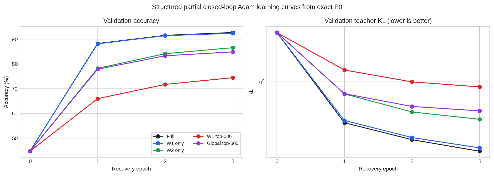

*All five arms improve through the third and final epoch; W2-only is the
strongest 500-quad trajectory.*

## Selected-checkpoint cost versus full-horizon cost

Every selected epoch was the final executed epoch. Consequently there is no
discarded post-selection pulse cost, but both denominators are retained here
so later experiments can differ without silently changing the accounting.

| Arm | Selected pulses | Three-epoch pulses | Discarded pulses | Selected effective changes | Three-epoch effective changes | Selected/full-horizon verify calls |
| --- | ---: | ---: | ---: | ---: | ---: | ---: |
| `full` | 303,231 | 303,231 | 0 | 247,243 | 247,243 | 10,314 / 10,314 |
| `w1_only` | 342,572 | 342,572 | 0 | 277,263 | 277,263 | 10,314 / 10,314 |
| `w2_only` | 17,844 | 17,844 | 0 | 13,348 | 13,348 | 7,815 / 7,815 |
| `w1_top500` | 34,306 | 34,306 | 0 | 27,163 | 27,163 | 9,114 / 9,114 |
| `global_top500` | 19,683 | 19,683 | 0 | 14,877 | 14,877 | 7,303 / 7,303 |

W2-only issued 5.88% of the full pulses; global top-500 issued 6.49%; W1
top-500 issued 11.31%. W1-only issued 112.97% of the full pulse count. The
full and W1-only trajectories are alternative nonlinear optimizations, so the
extra W1-only pulses cannot be interpreted as a separable W2 pulse saving.

On the pulse-versus-accuracy plane, P0, W2-only, and full are the nondominated
tested states. W2-only dominates both ranked 500-quad masks by reaching higher
accuracy with fewer pulses. Full dominates W1-only.

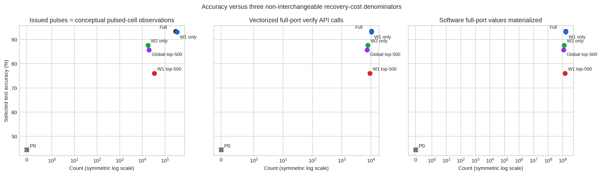

*Pulse commands, vectorized verify calls, and software values materialized are
different cost denominators and must not be interchanged.*

The recovery-only reduction is not the same as an end-to-end deployment
reduction. Adding the matched 2,819,260-pulse P0 deployment gives 3,122,491
total pulses before full recovery and 2,837,104 before W2-only recovery.
W2-only therefore saves 94.12% of *recovery* pulses but only 9.14% of pulses
in this complete deployment-plus-recovery accounting. The common P0 cost is
scientifically sunk for the mask comparison, but it matters for any system
cost claim.

## Pulse-local observations and full-port software verification

Pulse count, conceptual pulsed-cell observations, verify API calls, and
materialized tensor coordinates are deliberately reported as different
quantities:

| Arm | Issued pulses | Conceptual pulsed-cell observations | Full-port verify API calls | Full-port values materialized in software |
| --- | ---: | ---: | ---: | ---: |
| `full` | 303,231 | 303,231 | 10,314 | 1,637,863,200 |
| `w1_only` | 342,572 | 342,572 | 10,314 | 1,637,863,200 |
| `w2_only` | 17,844 | 17,844 | 7,815 | 1,241,022,000 |
| `w1_top500` | 34,306 | 34,306 | 9,114 | 1,447,303,200 |
| `global_top500` | 19,683 | 19,683 | 7,303 | 1,159,716,400 |

An issued pulse yields one conceptual post-pulse observation for its pulsed
cell, hence the first two columns are equal. The current vectorized software
interface nevertheless materializes all 158,800 coordinates whenever a pulse
round causes `VerifyPort.verify()` to be called, and then consumes only the
pulsed coordinates. Thus W2-only saves 94.12% of pulses but only 24.23% of
full-port API calls in this implementation.

The materialized-coordinate values are software/tensor accounting, not a
calibrated physical-read count. This run has no selective-read circuit
topology, read-energy model, or latency model. It would therefore be incorrect
to claim a 94% reduction in physical recovery energy from the pulse reduction
alone. Dense BPTT and digital Adam are also unchanged across arms.

## Mask composition, overlap, and ranking

| Arm | W1 / W2 quads | Physical cells | Corrupt cells in mask | Quads with at least one corrupt cell | Frozen P0 score mass |
| --- | ---: | ---: | ---: | ---: | ---: |
| `full` | 39,200 / 500 | 158,800 | 21,345 (13.44%) | 17,480 (44.0%) | 100.00% |
| `w1_only` | 39,200 / 0 | 156,800 | 21,069 (13.44%) | 17,252 (44.0%) | 90.43% |
| `w2_only` | 0 / 500 | 2,000 | 276 (13.80%) | 228 (45.6%) | 9.57% |
| `w1_top500` | 500 / 0 | 2,000 | 278 (13.90%) | 220 (44.0%) | 7.10% |
| `global_top500` | 317 / 183 | 2,000 | 291 (14.55%) | 231 (46.2%) | 12.86% |

Global top-500 is not a disguised layer-only mask. It contains 317 W1 and 183
W2 quads. Its logical Jaccard overlap with W1 top-500 is 0.464 (317 selected
quads in common) and its overlap with W2-only is 0.224 (183 in common). W1
top-500 and W2-only are disjoint. The selector did not receive the fault mask,
although its gradients were necessarily conditioned on the exact damaged P0
state.

The frozen gradient score is not by itself sufficient to explain recovery.
Global top-500 captured 12.86% of total P0 score mass, more than W2-only's
9.57%, but reached lower accuracy. Complete coverage of the small output layer
outperformed the tested mixed global ranking at the same 500-quad address
budget. This may reflect useful layer structure, the need to coordinate many
small output corrections, or limitations of a static P0 ranking; this single
run does not distinguish those explanations.

Post-hoc, the sparse masks capture little of the full trajectory's realized
pulse activity: 1.64% for W2-only, 1.31% for W1 top-500, and 1.65% for global
top-500. Full-arm touched-cell turnover was substantial. Only 2,669 cells
touched in epoch 2 had also been touched in epoch 1 (25.36% of epoch-2 touched
cells); only 1,391 epoch-3 cells had been touched in epoch 1 (16.72%); and just
202 cells were touched in all three epochs. This is evidence that temporal
turnover is a material caveat, not proof that every static ranking must fail.
The unmasked per-minibatch gradient and Adam-command demand was not serialized,
so missed dynamic demand cannot be reconstructed exactly.

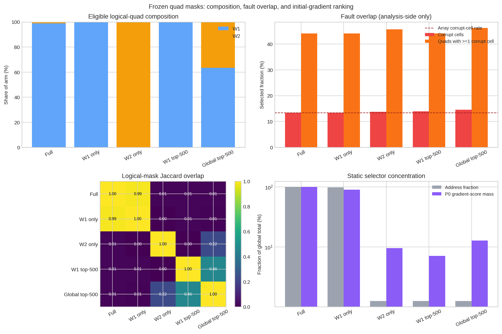

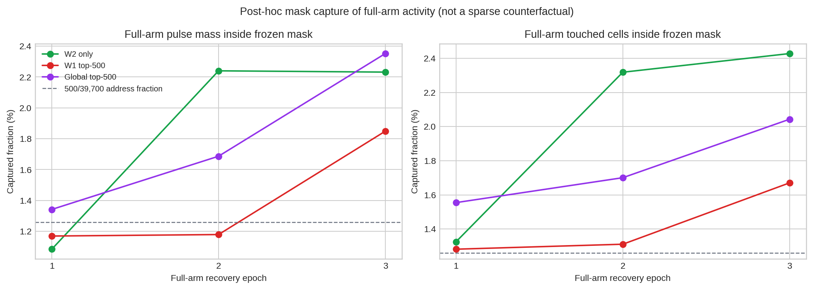

*The frozen masks are structurally distinct, but none captures a large share
of the full arm's evolving physical activity.*

## Fault, effectiveness, cap, and projection diagnostics

| Arm | Commands to corrupt cells | Effective changes | Unique commanded cells | Terminal debt cells (corrupt) | At cap with debt | Ever cap-blocked | Projection events / unique cells |
| --- | ---: | ---: | ---: | ---: | ---: | ---: | ---: |
| `full` | 53,241 (17.56%) | 247,243 (81.54%) | 32,390 | 350 (276) | 336 | 337 | 15,913,449 / 12,964 |
| `w1_only` | 62,043 (18.11%) | 277,263 (80.94%) | 37,418 | 419 (340) | 391 | 393 | 16,539,499 / 13,013 |
| `w2_only` | 4,315 (24.18%) | 13,348 (74.80%) | 1,338 | 39 (26) | 37 | 37 | 452,039 / 152 |
| `w1_top500` | 6,729 (19.61%) | 27,163 (79.18%) | 1,681 | 97 (47) | 96 | 99 | 996,064 / 212 |
| `global_top500` | 4,640 (23.57%) | 14,877 (75.58%) | 1,470 | 37 (28) | 36 | 36 | 562,813 / 175 |

Commands sent to corrupt cells are ineffective by construction. Conditional
on a command targeting a healthy cell, 98.50%--98.90% produced persistent
movement across the arms. The lower all-command effectiveness is therefore
primarily stuck-cell waste rather than widespread failure of healthy-cell
pulses.

The terminal target debt is heavily fault-concentrated for full, W1-only,
W2-only, and global top-500. W1 top-500 is different: 50 of its 97 remaining
debt cells are healthy, consistent with a restricted mask leaving a harder
compensatory tail. The corresponding cumulative cap-blocked debt events were
1,883,700 for full, 2,237,719 for W1-only, 169,082 for W2-only, 397,468 for W1
top-500, and 199,049 for global top-500.

The pulse controller cannot make an immutable corrupt device learn. A useful
future controller could infer repeated nonresponse from allowed pulse/verify
history and stop wasting pulses or redirect compensation, but it must not use
an oracle fault mask. That would reduce cost; it would not restore the missing
conductance degree of freedom.

Target projection is a material cointervention. It occurred in 15.91 million
cell-events for full and 0.45--1.00 million cell-events in the sparse arms.
Projection is required by the nonnegative \(G=2x\) contract, but it means this
experiment compares complete projected target-tracking packages rather than a
pure mask-cardinality intervention detached from controller dynamics.

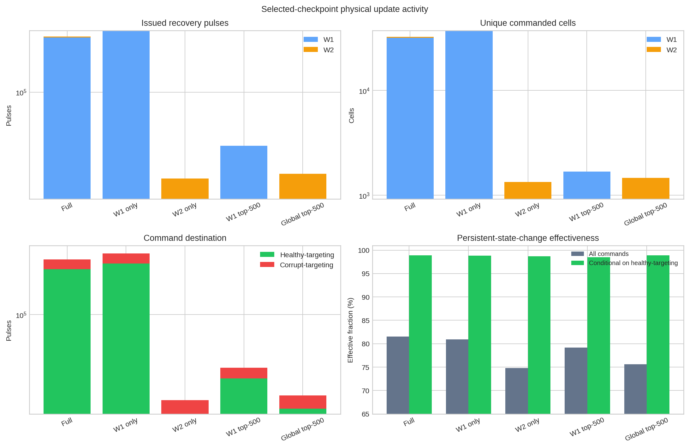

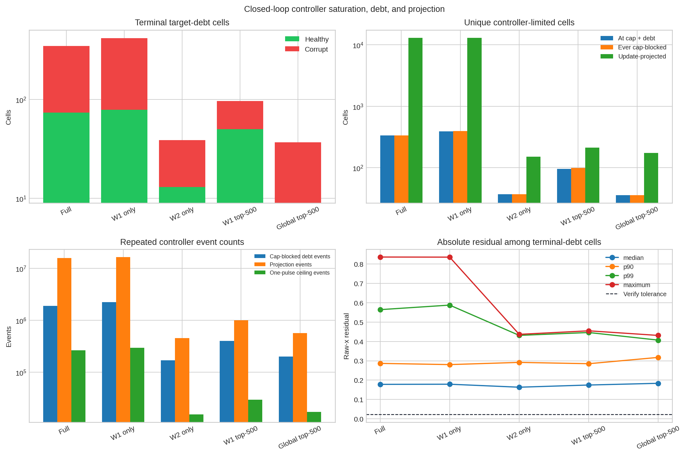

## Integrity and sealing checks

The completed bundle passed the following recomputed integrity gates:

- `manifest.json`, `status.json`, and `result.json` agree on run identity,
  experiment identity, timestamps, successful completion, and absence of an
  error;
- the canonical resolved-config SHA-256 is
  `2345022642dc1916983a62022371c9593756c6fdc95abb915f89165f2cdca1da`;
- all four immutable manifest inputs match their declared SHA-256 digests;
- all 18 declared result artifacts match both their registered SHA-256 and
  byte size;
- the `full` mask reproduces the prior closed-loop comparator exactly at every
  epoch in persistent and apparent plant state, plant draw indices, Adam
  moments and targets, pulse-count tensor, controller counters, data-loader
  continuation, validation predictions and metrics, and terminal test result;
- every selected logical weight contains all four physical cells and every
  saved mask matches its recorded hash;
- every frozen cell is exact to P0 in plant, RNG, optimizer, cache, target,
  direction, projection, cap, and pulse state in all 15 checkpoints;
- corrupt persistent states remain byte-exact, pulse-plant draw advancement is
  exactly two random draws per issued pulse, and all persistent conductances
  remain nonnegative; and
- all 15 epoch checkpoints and metrics contain `test: null`; validation
  selection froze for every arm before the terminal test evaluation.

The full mask's exact parity is particularly important: it shows that adding
mask support did not silently change the established full P&V comparator.
The mask wrapper metadata is intentionally newer, but the numerical trajectory
is unchanged.

## Provenance and dirty-tree caveat

The run completed on `nom-cool-2` in 555.175 seconds using Python 3.12.12 and
PyTorch 2.5.1+cu121. The source manifest records implementation commit
`cd9df576e75e9a09514de1bca7c0d0b960e5c6f4` (`Add structured partial P&V
fine-tuning sweep`). The run was launched with:

```text
ebl train \
  --config examples/mnist_relu_drn/ibm_om_exact_p0_structured_partial_pv_adam/partial_sweep.json \
  --output-dir results/mnist-ibm-om-exact-p0-structured-partial-pv-adam-exploratory-20260901-v1 \
  --teacher-weights data/mnist_relu_teacher_fixed_init_20260816.pt \
  --weights results/mnist-ibm-om-corrupt-multi-source-hwa-tuned-recovery-exploratory-20260831-v1/20260831T182040.075995Z-7f054bc5-3e515245/checkpoints/target_94004_seed_94301_exact_p0.pt \
  --device-model results/mnist-ibm-om-corrupt-multi-source-hwa-tuned-recovery-exploratory-20260831-v1/20260831T182040.075995Z-7f054bc5-3e515245/artifacts/target_94004/identity/paired_winsorized_assignment.json
```

The source manifest also records `dirty=true`, with dirty-tree hash
`c7debc34bb5139806c7a9d770eeeedb303f3ae551d6e0916fcdf44e29c99e7a1`.
The numerical implementation itself was committed before launch; the known
unrelated tracked modifications were `AGENTS.md`,
`docs/current_simulations.md`, and `docs/experimental_manifest.md`. The dirty
hash preserves the exact observed source state, but this is still not a clean
source revision suitable for canonical evidence. It is acceptable only under
the run's explicit `exploratory_noncanonical` label.

The primary machine-readable evidence is in the run-local
`artifacts/scientific_summary.json`; independent recomputation, input checks,
artifact checks, and diagnostic plot sources are in
`analysis/summary.json` and `analysis/post_run_analysis.md`. Raw result
directories remain ignored exploratory artifacts and are not promoted by this
report into the canonical experimental manifest.

The Stage-2 hybrid-fraction implementation was committed as
`1370fd5b3e39533c4f04ecc2e67f7fca022c8d17`; its run completed in 575.029
seconds and its scientific-summary SHA-256 is
`f633568529acd09fb2e2b9c42b6d7c71ebc7d01ffdf8f7aeb33016a3db27a8c2`.
The Stage-3 extension was committed as
`ea0eeafc79725322f732e0cb78e4cee613363d8f`; its run completed in 584.773
seconds and its scientific-summary SHA-256 is
`481ec105c37282fde49769b9c1fe4a3c080ba3877926c251ec36a5890a1097c9`.
Both manifests record the same known unrelated dirty-tree hash
`c7debc34bb5139806c7a9d770eeeedb303f3ae551d6e0916fcdf44e29c99e7a1`.
Each follow-up pinned and replayed its predecessor anchor exactly before
extending the fraction sweep.

## Interpretation

Three observations matter most.

First, the small W2 layer is a strong base but not a sufficient endpoint.
Updating all 500 W2 weights raises test accuracy from 44.45% to 87.62% with
17,844 pulses, yet leaves a 5.72-point gap to full recovery. Keeping W2 intact
and adding ranked W1 capacity closes that gap gradually: top-500 W1 reaches
89.39%, and top-2,000 W1 reaches 90.50%. This supports a structured hybrid
mask, not a claim that output-only tuning is enough.

Second, layer completeness and ranking both matter. Complete W2 beat the
mixed global top-500 mask even though the latter captured more frozen P0 score
mass. Within masks that all contain W2, however, ranked W1 additions beat the
same-cardinality random controls: ranked top-500 exceeded random-500 by 0.70
validation points with 2,475 fewer pulses, and ranked top-2,000 exceeded
random-2,000 by 0.80 points with 15,381 fewer pulses. These are directional
results from one deterministic random seed, not population estimates.

Third, physical write sparsity and system-level training sparsity are not the
same. The selected top-2,000 union issues only 17.05% as many recovery pulses
as full fine-tuning, but dense BPTT and digital Adam remain, and its 9,939
full-port verify calls are 96.36% of the full arm's 10,314. The experiment
demonstrates a simulated physical-write reduction under this controller. It
does not establish proportional read, energy, latency, memory, or autonomous
on-chip-training reductions.

## Completed hybrid fraction follow-ups

Two validation-first follow-ups extended the Stage-1 frontier. Every arm
started again from exact P0, retained all 500 W2 quads, and added a nested
prefix of the same frozen P0-gradient ranking within W1. The Stage-2 run was
`20260901T114836.063168Z-93bc30a9-0f3f22c2`; the Stage-3 run was
`20260901T122213.464888Z-f944f57d-a5d112eb`.

### Stage 2: locating the first useful W1 supplement

| Arm | Added W1 quads | Validation accuracy | Validation KL | Recovery pulses | Test accuracy |
| --- | ---: | ---: | ---: | ---: | ---: |
| W2 only | 0 | 86.56% | 0.397773 | 17,844 | 87.62% |
| W2 + W1 top-125 | 125 | 87.08% | 0.383742 | 21,430 | sealed |
| W2 + W1 top-250 | 250 | 87.22% | 0.377240 | 24,743 | sealed |
| W2 + W1 top-500 | 500 | 88.04% | 0.348499 | 30,346 | 89.39% |
| W2 + random W1-500 | 500 | 87.34% | 0.371876 | 32,821 | sealed |

The predeclared gate required at least 50 additional correct validation
examples over W2-only, lower KL, and no more than 25% of the full arm's pulse
count. Top-125 and top-250 did not reach the accuracy threshold. Ranked
top-500 did, and was therefore the smallest Stage-2 qualifier. Its test gain
over W2-only was 1.77 points.

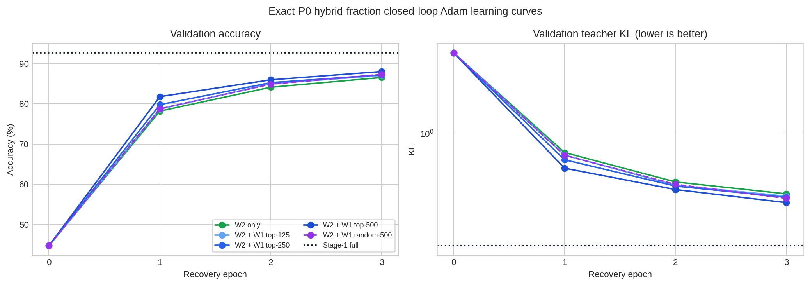

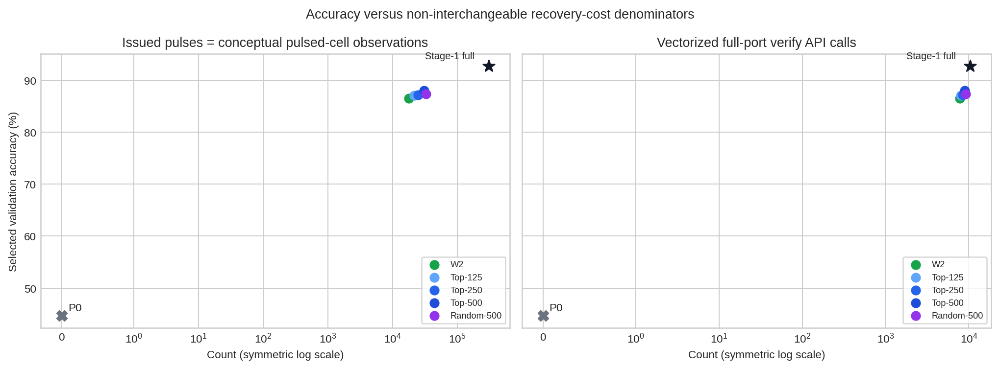

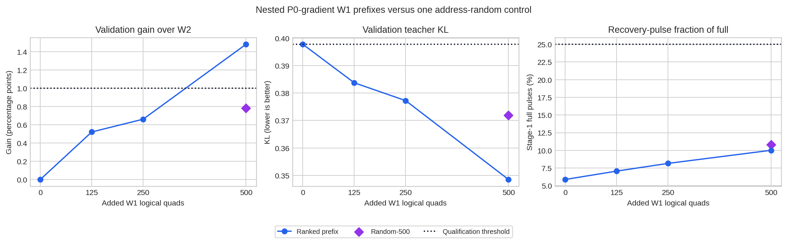

### Stage 3: extending the ranked W1 fraction

Stage 3 replayed the top-500 anchor exactly, then tested larger nested W1
prefixes and one same-cardinality random-2,000 control. Qualification was
measured against the top-500 anchor using the same one-point validation-gain,
lower-KL, and 25%-of-full-pulses rules.

| Arm | Total logical quads | Eligible physical cells | Validation accuracy | Validation KL | Recovery pulses | Fraction of full pulses | Test accuracy |
| --- | ---: | ---: | ---: | ---: | ---: | ---: | ---: |
| W2 + W1 top-500 | 1,000 | 4,000 | 88.04% | 0.348499 | 30,346 | 10.01% | 89.39% |
| W2 + W1 top-1,000 | 1,500 | 6,000 | 88.78% | 0.326623 | 38,064 | 12.55% | sealed |
| W2 + W1 top-2,000 | 2,500 | 10,000 | 89.64% | 0.300360 | 51,708 | 17.05% | 90.50% |
| W2 + W1 top-4,000 | 4,500 | 18,000 | 89.96% | 0.279942 | 76,720 | 25.30% | sealed |
| W2 + random W1-2,000 | 2,500 | 10,000 | 88.84% | 0.338892 | 67,089 | 22.12% | sealed |

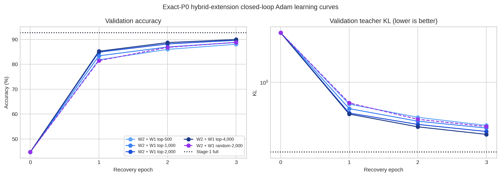

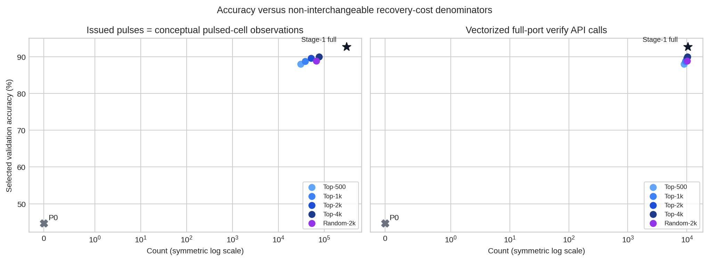

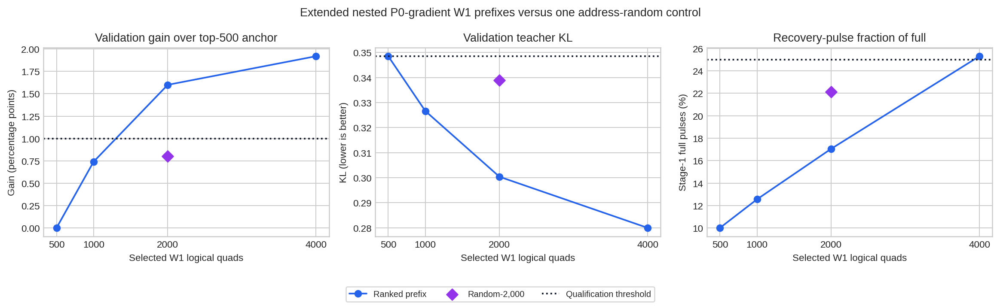

Top-1,000 missed the one-point accuracy threshold. Top-2,000 passed every
gate and was selected. Top-4,000 improved validation by only another 0.32
points while adding 25,012 pulses and narrowly exceeded the 25% ceiling.
Thus top-2,000 is the best tested point under the declared recovery-write
budget, rather than an accuracy optimum.

At the same 2,000-W1 cardinality, the ranked prefix captured 21.90% of total
W1 score mass versus 5.17% for the random mask. Their selected corrupt-cell
fractions were similar (13.59% versus 13.45%), so explicit fault-mask exposure
does not explain the ranked advantage; the selector never received that mask.
This supports concentration of the frozen P0-gradient score as a plausible
mechanism, subject to the one-mask and static-ranking limits.

The selected mask contains 2,500 of 39,700 logical weights and makes 10,000
of 158,800 physical cells eligible. Of those, 5,291 received at least one
command and 4,376 ended in a persistent state different from P0. It issued
51,708 commands, produced 40,238 persistent state-change events, and sent
11,019 commands to immutable corrupt cells; no corrupt cell moved. Test
accuracy was 90.50% (9,050/10,000), 2.84 points below full fine-tuning, while
retaining 94.19% of the P0-to-full aggregate accuracy gain.

The recovery-only pulse ratio is favorable, but the lifecycle denominator is
less dramatic. Including the common 2,819,260-pulse deployment, the selected
path uses 2,870,968 pulses versus 3,122,491 for full recovery, an 8.06%
end-to-end reduction. Its 9,939 vectorized full-port verify calls are 96.36%
of full. Selective-read hardware and a read-energy model would be needed to
turn the write result into an energy or latency claim.

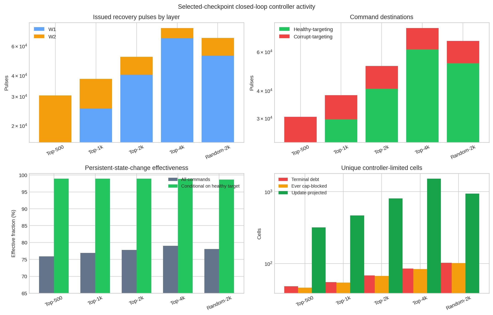

Both follow-ups preserved validation-first selection: every candidate's epoch
was frozen before test access, random controls remained validation-only, and
only the parity anchor plus the smallest qualifying ranked union opened test.
Nevertheless, the same target endpoint and MNIST test set had already been
inspected in earlier stages. The staged frontier is therefore adaptive
exploratory evidence, not a fresh confirmatory test.

## Limitations and claim boundary

This report does not support claims beyond the matched run because:

- only one previously inspected target assignment and endpoint were used;
- the device is a model-based, analyst-Winsorized AIHWKit IBM-OM simulator,
  not raw measured pulse traces or fabricated hardware;
- the P0 gradient ranking is static and may miss later update turnover;
- the two same-cardinality random controls each use one deterministic mask
  seed, so their ranked-versus-random differences are directional only;
- the staged mask sizes and test openings were adaptively chosen after earlier
  results on this same target endpoint;
- three epochs are a fixed horizon, not demonstrated convergence;
- dense digital BPTT, teacher logits, global selector gradients, and digital
  Adam moments are not autonomous local on-chip learning;
- target accumulation and \([0,1]\) projection are controller
  cointerventions;
- cached-apparent feedback with at most one pulse per cell per minibatch is not
  full-convergence P&V;
- the vectorized verify implementation does not model selective physical
  reads, read energy, or latency;
- there is no fresh inference-read noise, retention, drift, or line resistance;
  and
- there is no target-assignment, endpoint-seed, or mask-seed replication.

Accordingly, the defensible conclusion is that partial P&V fine-tuning is a
promising write-cost direction and complete W2 plus a modest ranked W1 prefix
is the strongest tested structure at this one simulated endpoint. The selected
6.30%-eligible mask recovers most, but not all, of the full accuracy gain while
substantially reducing recovery writes. It is not a replacement for full
recovery, and fresh target-assignment and endpoint replication is needed before
making a deployment claim.
