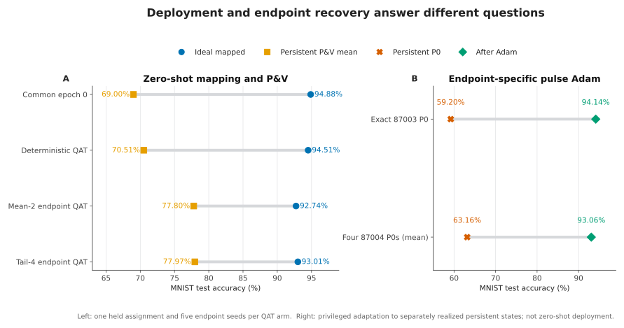
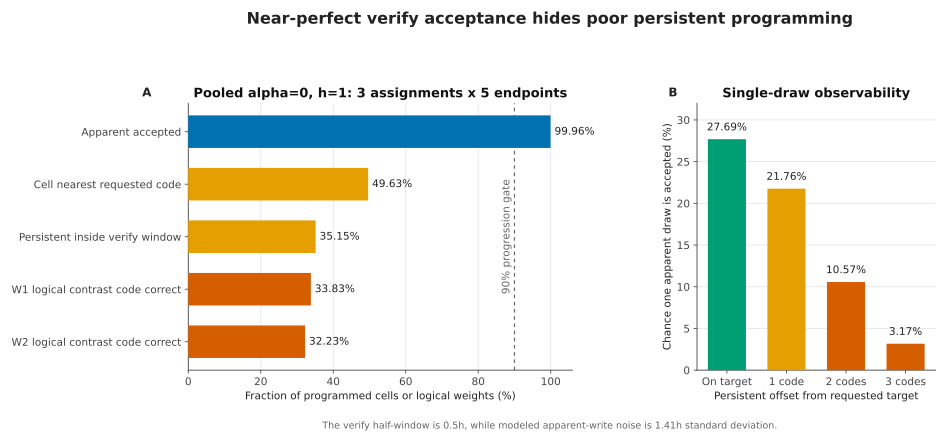
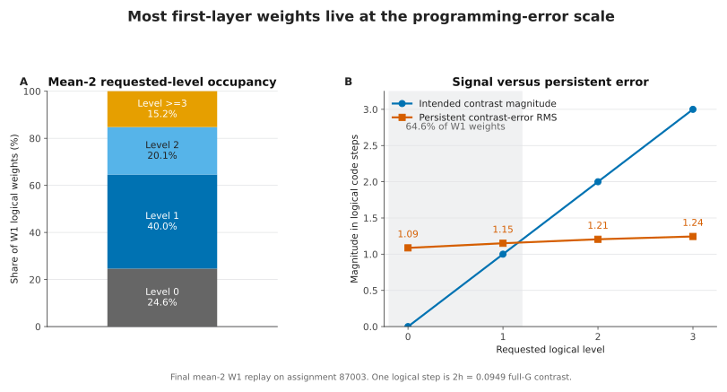
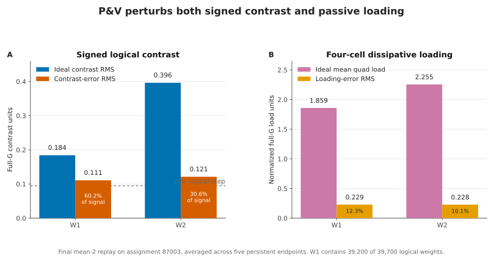
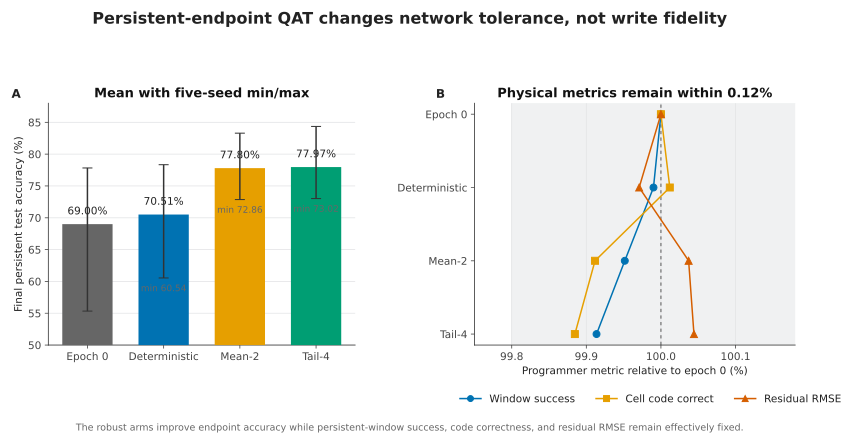
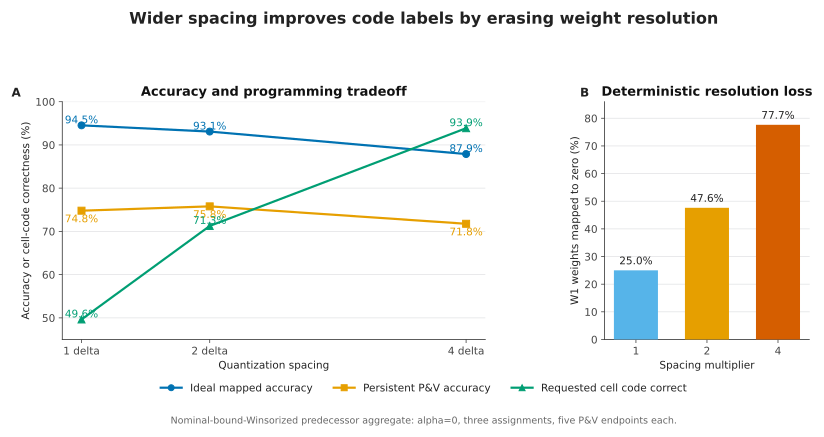

# IBM OM Winsorized training, transfer, and pulse recovery

- Review date: 2026-08-31
- Result dates: 2026-08-28 through 2026-08-30
- Evidence tier: `exploratory_noncanonical`
- Device source: AIHWKit 1.1.0 `ReRamArrayOMPresetDevice`
- Evidence class: normalized hardware-derived fitted model, not raw measured
  traces and not an absolute-conductance calibration

## Provenance and review boundary

This document is a retrospective synthesis of local exploratory runs. The
August 29 runs record base commit `6d55eae7`, `dirty=true`, and different
stage-specific dirty-tree hashes. The implementation and documentation commits
made after the runs package and review that evidence; they are not the clean
source revision that originally produced every checkpoint. Exact input,
checkpoint, result, and scientific-summary hashes stored in the local run
manifests remain the authoritative lineage. A clean rerun is required before
promoting any result to canonical evidence.

## Executive interpretation

The perfect-diode DRN was not trained from a random initialization. A frozen
bias-free ReLU network supplied both the signed source weights and the teacher
logits. Its weights were normalized layer by layer and mapped into the DRN's
four nonnegative conductance rails. The resulting continuous and ideal
quantized DRNs reached about 95%, establishing that the teacher-to-DRN
initialization and noiseless mapping were functional before stochastic
programming.

Persistent-endpoint-aware QAT then made the DRN materially more tolerant to
programming variability. Three epochs of mean-two or tail-four endpoint
training raised the final five-endpoint P&V mean from 70.51% for deterministic
QAT to 77.80% and 77.97%. The underlying writer did not improve: persistent
RMSE, verify-window success, and requested-code correctness were essentially
unchanged. The training learned a different decision function that tolerated
more of the same physical error.

The remaining deployment loss is best explained by the combination of the
one-read controller and the fitted pulse plant. Apparent verification accepts
about 99.96% of cell writes, but only about 35% of persistent endpoints lie in
the verify window and only about 49.5% decode to the requested cell level at
one-delta spacing. The apparent observation noise is larger than one code
spacing and about 2.82 times the verify half-window. Four independently
programmed rails then turn these cell errors into signed-contrast error and
common-mode loading error in the passive DRN.

Target-specific pulse adaptation is nevertheless very effective. One epoch
of hardware-in-loop digital Adam, whose only weight mutation is an open-loop
stochastic SET or RESET pulse, recovered about 93% across five separately
programmed endpoint realizations of one target array identity. Adam did not
restore the requested conductance configuration; it found a task-effective
physical state for each realized endpoint.

The supported exploratory conclusion is therefore that offline
hardware-/endpoint-aware training and target-specific pulse adaptation are
promising complementary mechanisms. The experiments do not yet establish
that complementarity across independent arrays: there is no matched
HWA-by-recovery factorial over multiple untouched target identities. They also
do not establish fabricated-device behavior, because the source is a fitted
normalized model and the headline runs use analyst-imposed bound
Winsorization and counterfactually repaired identities.

## Initialization and physical contract

The frozen source checkpoint is
`data/mnist_relu_teacher_fixed_init_20260816.pt`, SHA-256
`9a961a77628e365b54fdf59304ec7fddf46f1f4834c4c03cecea9c204f837f52`.
It is a bias-free ReLU network with 97.36% held-out test accuracy. Earlier
workflow-reviewed initialization evidence mapped the same signed source into
a bounded four-rail DRN at 97.38% with 99.94% teacher agreement, showing that
the architecture lift itself can be essentially lossless. For each layer in
the recent lineage, the ReLU weights are divided by that layer's absolute
maximum to initialize one normalized FP32 logical master. Sign is represented
by the selected pair of rails in the four-device quad. The evaluated student
remains a perfect-diode DRN; the ReLU network is a source and frozen teacher,
not a substitute student architecture.

The selected normalized mapping uses shared destination-column baselines,
`alpha=0`, one-delta spacing for the training/recovery lineage, layer scale
fractions `[1,1]`, and fixed positive logit gain `14.12537544622754`. Every
branch enters the circuit as its complete nonnegative conductance
`G=a+1=2x`. Baselines are never removed from the voltage denominator.

The device intervention first samples and jointly assigns IBM OM identities,
counterfactually repairs corrupt quads, Winsorizes every sampled hard bound to
`a in [-1,1]`, and recommissions RESET on that modified plant. This is not
default AIHWKit behavior. Approximately 75% of cells have at least one bound
changed and approximately 25% have both changed. Results from this lineage are
therefore sensitivity controls on a normalized model, not physical
microSiemens or power evidence.

## Accuracy ladder

The rows below intentionally retain their coverage. Assignment ranges and
endpoint ranges are observations over fixed samples, not confidence
intervals, and rows with different coverage are not paired causal
comparisons.

| Stage | Ideal or starting accuracy | Persistent or adapted accuracy | Scope |
| --- | ---: | ---: | --- |
| Winsorized `alpha=0,h=1 delta_x` map | 94.53% ideal | 74.79% P&V mean | Three held-out assignments, five endpoints each |
| Multi-assignment deterministic QAT | 94.47% ideal | 70.38% P&V mean | Final assignment 87003, five endpoints |
| Three-epoch deterministic QAT | 94.51% ideal | 70.51% mean; 60.54--78.34% | Assignment 87003, five endpoints |
| Three-epoch mean-two endpoint QAT | 92.74% ideal | 77.80% mean; 72.86--83.30% | Assignment 87003, five endpoints |
| Three-epoch tail-four endpoint QAT | 93.01% ideal | 77.97% mean; 73.02--84.35% | Assignment 87003, five endpoints |
| Exact source-array P0 plus Adam | 59.20% persistent P0 | 94.14% | One assignment-87003 endpoint |
| Source state re-anchored on target 87004 | 92.02% before writing | 65.38% P&V mean; 60.12--74.24% | One new array identity, five endpoints |
| Fixed Adam replication on target 87004 | 60.12--66.29% P0 | 92.74--93.62%; 93.07% mean | Four additional endpoints on the same target identity |



The left panel compares zero-shot mapping and programming on assignment 87003.
The right panel is privileged endpoint-specific recovery and answers a
different question; it must not be joined into a single causal accuracy ladder.

The source-to-target experiment also retained a literal cell-by-cell full-G
transfer as an analysis diagnostic. It reproduced the 94.14% source state
before writing, but 33,220 of 158,800 requested cell states were outside the
target support and the P&V result fell to 44.25%. That diagnostic establishes
that literal physical-state copying is invalid. It is not the headline target
mapping. Target-owned baseline re-anchoring reduced unsupported cells to 113
and retained 92.02% before writing.

## What failed during program-and-verify

At one-delta spacing, `h=0.04745` raw `x` and the verify half-window is
`0.023725`. The fitted apparent write-observation standard deviation is about
`0.06697` raw `x`, or `1.41h`. One apparent observation therefore does not
reliably distinguish adjacent persistent codes.

Pooled over three predecessor assignments and five endpoints per assignment:

- apparent acceptance is 99.9567%;
- persistent verify-window success is 35.1477%;
- conditional persistent success after apparent acceptance is 35.1627%;
- requested cell-code correctness is 49.6306%; and
- only 0.0433% exhaust the 128-pulse budget.

This is not primarily a pulse-cap failure. The controller repeatedly receives
new noisy apparent values after pulses and can stop on a favorable
observation even when the persistent state is a code or more away. Pulse
granularity and state dependence also matter: a typical SET step near the
target is comparable to or larger than the code spacing, and reversals are
common. A matched noise/controller factorial is still required before
assigning the entire effect uniquely to observation noise.



The repaired target-aware cross-array result independently rejects gross
support failure as the headline explanation. Only 113 target cells were
outside support, projection would change no-write accuracy by only 0.02
points, and only 68--90 cells exhausted the programming budget per endpoint.
The native published-corruption model did contain a 21,466-site corrupt mask
in an earlier 158,800-cell assignment, but the Winsorized training and
recovery lineage disables those corrupt identities. Corruption cannot explain
its reported 65--78% deployment accuracies.

## Why the passive DRN amplifies the residual

A logical four-rail contrast is

```text
C = (G++ - G+- - G-+ + G--) / 2,
```

while the same four full conductances contribute positively to dissipative
loading. Requested shared baselines cancel exactly from ideal `C`, but they
belong to distinct cells and are programmed independently. Persistent errors
break both pairwise equalities, injecting random contrast into nominal zero
weights while also moving the denominator and the network operating point.

For final mean-two QAT, W1 ideal contrast RMS is about `0.1842` and persistent
contrast-error RMS is about `0.1109`. Approximately 64.6% of W1 weights occupy
requested level zero or one, while a single logical contrast step is only
`0.0949`. Much of W1 therefore operates at the programming-noise scale. W1
contains 39,200 of the model's 39,700 logical weights, so it dominates
cell-count-weighted diagnostics. A layerwise intervention is still needed to
prove that it dominates accuracy causally.

This provides a credible mechanism for stronger sensitivity than a simple
linear crossbar MVM: the DRN's full conductances affect both useful coupling
and loading. It does not constitute a matched DRN-versus-crossbar result. Such
a claim requires identical device identities, target codebooks, programming
streams, source model, and training budget in both architectures.





### Preliminary crossbar controls

A descendant branch, `codex/ibm-om-crossbar-digital-relu` at commits
`ab610d22` and `30798ddf`, contains two reduced fresh-array smokes rather than
the full predeclared eight-arm comparison. In the repaired apparent-forward
smoke, direct and HWA source/target accuracies remained approximately
94.1--96.7%, while deterministic QAT transfer ranged from 73.7% to 92.45%.
The hidden persistent target means were much lower: approximately 66.98%,
66.78%, and 55.20% for direct, HWA, and QAT. A published-defect extension
retained 13.31--13.80% corrupt cells and reduced pooled target apparent means
to 89.76%, 83.35%, and 76.30%; every portability gate failed.

These smokes show that published corruption is materially harmful when it is
retained. They do not explain the repaired Winsorized DRN results, and they do
not yet prove that a crossbar needs no endpoint recovery. The crossbar uses an
apparent differential `q=a-r` forward, whereas the DRN headline uses
persistent full `G`; the tensor sizes, cell populations, and adaptation
histories are also different. The full matched architecture control remains
unrun.

## What robust endpoint QAT achieved

The deterministic, mean-two, and tail-four arms begin from the same ReLU-
initialized logical master and use the same two training assignments,
selection assignment, final assignment, minibatch order, and three-epoch
budget. Mean-two optimizes 25% ideal loss and 75% mean loss over two persistent
endpoint-table views. Tail-four uses 25% ideal loss, 50% four-view mean loss,
and 25% batch-worst persistent loss.

Mean-two and tail-four improve every final endpoint relative to the common
epoch-zero state and reduce the five-seed spread. They do so without improving
physical programming:

| Arm | Persistent RMSE | Requested code correct | Persistent in window |
| --- | ---: | ---: | ---: |
| Deterministic | 0.05540 | 49.592% | 35.098% |
| Mean-two | 0.05543 | 49.542% | 35.085% |
| Tail-four | 0.05544 | 49.529% | 35.072% |

The robust arms instead alter a small subset of code thresholds and improve
the decision geometry under the sampled error distribution. The cost is
approximately 1.5--1.8 points of ideal accuracy relative to deterministic
QAT. Tail-four is effectively tied with mean-two: its final mean is only
0.168 point higher and its observed spread is slightly larger. A four-member
finite bank is too small to establish a worst-case objective advantage.



## What target-specific pulse adaptation achieved

The initial deployment uses closed-loop P&V. Recovery then disables verify
access at the optimizer write interface. Digital teacher logits, BPTT, and
optimizer state compute commands, while selected cells receive open-loop
stochastic physical pulses on the continuing persistent plant. Network
forward passes use persistent full `G`; apparent post-write values are never
substituted for it.

On the first exact source endpoint, direct-rail Adam at `3e-5` moved 59.20% to
94.14% using 54,834 pulses, with zero cap hits. On target 87004, the same fixed
one-epoch Adam protocol moved the four additional endpoints from
60.12--66.29% to 92.74--93.62%, a mean of 93.065%. Together with the original
predeclared endpoint at 93.14%, this shows repeatable recovery across five
stochastic endpoint realizations of one target identity.

The optimizer comparison on endpoints 89402--89405 gave:

| Optimizer | Final mean | Mean gain over its exact P0 | Main-array pulse cost |
| --- | ---: | ---: | ---: |
| Open-loop SGD | 88.4575% | +25.2975 pp | 273,066 pulses |
| Open-loop Adam | **93.0650%** | **+29.9050 pp** | **227,665 pulses** |
| OM-plant Tiki-Taka-v1 equation emulator | 90.5175% | +27.3575 pp | 280,860 slow plus about 19.0 million fast pulses |
| OM-plant unchopped-TTv2 equation emulator | 90.8300% | +27.6700 pp | 286,407 slow plus about 18.9 million fast pulses |

Adam wins every endpoint and is the most pulse-efficient tested recovery. The
Tiki-Taka arms are qualified equation emulators rather than native published
hardware implementations: they retain digital gradients and use a separate
OM fast plant. Their initially selected output-layer transfer was nearly
inactive. A W2-only transfer-gain follow-up made the transfer execute but
reduced TT1 and TTv2 means by 0.99 and 1.20 points, respectively, on all four
paired endpoints. That follow-up rejects its selected multipliers, not all
possible Tiki-Taka transfer settings, because the 512-batch development screen
underexposed the full-epoch W2 behavior.

Recovery proves that useful physical states remain available and that the
realized endpoint is adaptable. It does not prove P&V accuracy. Adam can
increase accuracy even while moving farther from the originally requested
conductance tensor, so it is learning task compensation rather than repairing
the writer. It is also a privileged hardware-in-loop upper control: exact
persistent simulator states drive BPTT, while teacher logits, optimizer
moments, and pulse-selection randomness remain digital.

## Defensible conclusions

1. ReLU-teacher initialization and ideal four-rail mapping are strong enough
   to separate deployment loss from random DRN initialization.
2. Shared-zero baseline construction and full-conductance accounting are
   necessary. Arbitrary global translation or baseline subtraction gives
   misleading DRN behavior.
3. In the repaired target-aware path, one-read P&V observability and pulse
   granularity are the best-supported proximate deployment bottleneck;
   corruption and gross target unreachability are not.
4. Persistent-endpoint QAT improves tolerance to an error distribution but
   cannot compensate the exact high-dimensional error field of a future
   endpoint.
5. Open-loop pulse Adam can adapt an exact persistent endpoint to about 93%
   on the tested target array. This is an endpoint-specific recovery result,
   not zero-shot deployment accuracy.
6. The combination of robust offline initialization and endpoint-specific
   recovery is promising, but complementarity across independent arrays is
   not yet causally established.



## Results that must not be claimed

- The IBM source is not raw measured trace replay and has no unique absolute
  conductance calibration.
- Default AIHWKit does not Winsorize every identity to `[-1,1]`.
- Five endpoint seeds are five stochastic writes on one array identity, not
  five arrays.
- The reported Adam is not fully autonomous on-chip Adam; it retains digital
  teacher, BPTT, moments, and command randomness.
- The current experiments do not establish DRN inferiority to crossbars.
- The current experiments do not establish that tail-four is better than
  mean-two QAT or that TTv2 is better than TTv1.
- No result includes inference-read noise, retention, drift, aging, endurance,
  or a measured peripheral implementation.

## Next decisive experiments

1. **Qualify the writer first.** At fixed one- and two-delta codebooks,
   decompose deterministic/stochastic pulses and noise-free/noisy verify, then
   test a state estimator or a newly justified fresh-read multi-sample rule.
   Require at least 90% persistent requested-code correctness before promoting
   the deployment scheme.
2. **Run a matched complementarity factorial.** Use several independent source
   and untouched target array identities. Cross deterministic QAT and robust
   endpoint QAT with frozen deployment and fixed pulse-Adam recovery, keeping
   target endpoints and all selection streams matched.
3. **Improve robust QAT only after the writer gate.** Compare one- versus
   two-delta spacing, fresh endpoint resampling, larger training-array
   coverage, and mean versus CVaR-style objectives. Select on disjoint arrays
   and report ideal cost as well as persistent mean and lower tail.
4. **Replicate the winner under missing nonidealities.** Add inference-read
   noise, retention/drift, pulse-cost and endurance accounting, and independent
   optimizer realizations.
5. **Resolve the physical coordinate.** Replace analyst Winsorization with a
   versioned absolute HRS/LRS calibration or measured conductance traces before
   making fabricated-array, power, or physical loading claims.
6. **Test the architecture hypothesis.** Compare the perfect-diode DRN with a
   crossbar plus digital ReLU under identical logical source weights, sampled
   cells, codebooks, programming streams, and training budget.

## Local artifact index

These result roots are intentionally ignored and remain local evidence for
this exploratory review:

- `results/mnist-ibm-om-baseline-spacing-pv-winsorized-nominal-exploratory-20260828-v2/`
- `results/mnist-ibm-om-winsorized-multi-assignment-qat-exploratory-20260829-v1/`
- `results/mnist-ibm-om-winsorized-onchip-adam-exploratory-20260829-v1/`
- `results/mnist-ibm-om-winsorized-cross-array-open-loop-adam-exploratory-20260829-v1/`
- `results/mnist-ibm-om-winsorized-endpoint-optimizer-recovery-exploratory-20260829-v1/`
- `results/mnist-ibm-om-winsorized-tt-output-transfer-followup-exploratory-20260829-v1/`
- `results/mnist-ibm-om-winsorized-pv-ensemble-qat-exploratory-20260829-v1/`

The detailed P&V failure analysis, derived metrics, and plots are under the
last root's `analysis/` directory. Because these are direct exploratory runs
rather than prepared workflow-managed studies, this review does not add a
finalized block to `experimental_manifest.md`.
